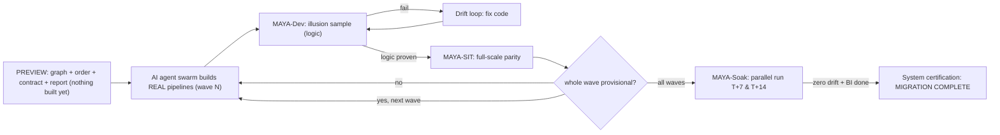

# MAYA - Migration Accelerator

[](https://github.com/vasutechgenie/maya-migrate-to-databricks/actions/workflows/ci.yml)
[](LICENSE)
[](pyproject.toml)

**MAYA** turns *any* data-platform migration **to Databricks** into a **deterministic,
reviewable engineering process** instead of an artisanal rewrite. It reads your exported
source metadata and produces a full **preview** of the migration - one normalized
dependency graph, a provable build order, a per-pipeline contract, and a branded report -
*before anything is built*. Then a **swarm of AI coding agents builds the real pipelines**,
wave by wave, each one self-validating against the source through a strict three-phase
parity gate. The run finishes with a single **whole-system certification**: when every
pipeline and dashboard is certified, the migration is complete and the source can retire.

**Source-agnostic by design.** The core never sees your source technology - it only ever
operates on a normalized graph. A thin **adapter** is the *only* piece that understands a
given source, so the same engine migrates:

| Source | Adapter status |
|---|---|
| **Azure Synapse** (SQL DW + Automic/UC4) | reference adapter (shipped) |
| **Snowflake** | adapter (SourceAdapter contract) |
| **Amazon Redshift** | adapter |
| **Hadoop / Hive / Spark (on-prem)** | adapter |
| **Microsoft SQL Server / SSIS** | adapter |
| **Teradata**, **Oracle**, **Netezza** | adapter |
| **Informatica / ADF / dbt** (orchestration) | adapter |

Every one of these lands the *same* normalized graph, so build order, contracts, engines,
the sampler, and the three-phase parity gate are identical regardless of where you're coming
from. Onboarding a new source is "write an adapter," not "fork the tool" - see the
[adapter authoring guide](docs/12_adapter_authoring_guide.md).

The name says how the *validation* works. *Maya* means "illusion": the first thing each
agent does after building a pipeline is prove its logic against a small **illusion of
production** - every table, but only a few thousand rows each - so correctness is proven
cheaply before the one expensive full-scale run. The illusion is the cheap first gate
*inside* the build loop, not the deliverable; only when logic is proven does MAYA prove
parity at full scale on production-copied data, and then keep re-proving it while both
systems run in parallel, because a pipeline that matches at cutover can still **drift** a
week later.

> Everything in this repo is source-agnostic core + a reference Synapse adapter + a fully
> runnable synthetic demo (**Northwind**). No customer data, no credentials, no live
> connections required.



## 60-second quickstart (the Northwind demo)
```bash
git clone https://github.com/vasutechgenie/maya-migrate-to-databricks
cd maya-migrate-to-databricks
pip install -r requirements.txt        # reportlab, pypdf, PyYAML

make demo     # graph -> order -> verify -> context -> orchestrate -> sample -> validate -> certify -> report -> bi
make test     # the deterministic goldens for the demo
```
`make demo` runs the whole workflow on `examples/northwind/` (a fictional retailer moving
to Databricks - Synapse is used as the worked source, but the flow is identical for any
source) and writes every artifact to `examples/northwind/out/`: a normalized graph, a
verified 5-wave build order, per-pipeline contracts (the preview), the agent work queue by
wave, RI-preserving dev sample SQL, MAYA parity SQL for dev/sit/soak, the whole-system
certification rollup, and a branded PDF report.

Run a single phase yourself:
```bash
python3 cli.py graph    --config examples/northwind/northwind.yaml   # preview: normalized graph
python3 cli.py order    --config examples/northwind/northwind.yaml   # preview: build waves
python3 cli.py verify   --config examples/northwind/northwind.yaml   # preview: independent order check
python3 cli.py context  --config examples/northwind/northwind.yaml   # preview: per-pipeline contracts
python3 cli.py report   --config examples/northwind/northwind.yaml   # preview: branded PDF
python3 cli.py orchestrate --status --config examples/northwind/northwind.yaml   # build: agent queue by wave
python3 cli.py maya sample --config examples/northwind/northwind.yaml --pipeline nw_build_sales   # illusion sample
python3 cli.py validate --config examples/northwind/northwind.yaml --pipeline nw_build_marts --env soak   # MAYA parity SQL
python3 cli.py certify  --config examples/northwind/northwind.yaml   # whole-system: migration complete?
```

## The MAYA validation technique (two-phase + sustained soak)
| Phase | Data | Proves | Cost |
|---|---|---|---|
| **MAYA-Dev** | every table, sampled to N rows (default 10k) | logic is correct: schema, keys, referential integrity, no-extra-output, idempotency, transform spot-checks | tiny |
| **MAYA-SIT** | production-copied data (full volume) | full-scale parity: all 10 checks incl. row-count, checksum, aggregates, point-in-time (**provisional cert**) | paid once, when logic is already right |
| **MAYA-Soak** | live parallel loads at T+7 & T+14 | **sustained** parity: all 10 on the cumulative table **and** the incremental delta, so slow incremental-logic drift is caught (**final cert**) | two scheduled runs per window |

**Gate rule:** MAYA-Dev AND MAYA-SIT green earns a **provisional** certification; the
pipeline then runs in parallel with the source and must re-prove parity at every soak
window (default T+7, T+14) with **zero drift** for **final** certification. Point-in-time
parity proves *state*; the soak proves the *ongoing incremental logic* stays equal over
time. Sampling is referential-integrity-preserving (seed rows + foreign-key closure) so
joins actually resolve on the sample.

## How it works
*Preview (nothing is built yet - a human can review the plan first):*
1. **Adapter** parses your exported source (Synapse, Snowflake, Redshift, Hadoop/Hive, SQL Server, Teradata, Oracle, ...) into a normalized graph (`objects.csv` / `edges.csv`) - the single boundary between "your source" and the source-agnostic core.
2. **Order** computes a topological build order (waves) via Tarjan SCC + longest-path layering.
3. **Verify** re-derives the order with *different* algorithms (Kosaraju + memoized DFS + Kahn) and proves it correct - an independent check, not a rubber stamp.
4. **Context** emits a deterministic per-pipeline contract: prereqs, produced tables (tagged bronze/silver/gold), parity targets, reachable procs, and a data-flow diagram.
5. **Report** - a branded PDF previewing waves, engines, parity, and connections.

*Build + certify (the AI agent swarm turns the preview into the real lakehouse):*
6. **Orchestrate** - a pool of AI coding agents drains each wave's queue in parallel and builds the **real** pipelines with the reusable **engines E1-E7** (SQL-first), translating the actual source logic - never inventing.
7. **MAYA sample / validate** - each agent proves its pipeline on the illusion of prod (logic), then at scale on prod-copied data (MAYA-SIT), then re-proves it in parallel run (MAYA-Soak, T+7/T+14). A **wave advances only when every pipeline in it is provisionally certified.**
8. **Certify** - `maya certify` rolls all per-pipeline gates and BI across all waves into one system state: `MIGRATION_IN_PROGRESS` -> `SYSTEM_PROVISIONAL` -> `MIGRATION_COMPLETE`. Only `MIGRATION_COMPLETE` clears the source for retirement.

## What is reusable vs per-source
| Reusable core (this repo) | Per-source adapter (you implement) |
|---|---|
| graph model, build order + independent verifier | collect the source artifacts |
| contract + classifier, engine catalog (E1-E7) | parse artifacts -> normalized graph |
| MAYA sampler + 3-phase parity framework | index source DDL |
| agent orchestration, BI migration | extract connection inventory |
| branded PDF reports + dashboard DDL | dialect translate (source SQL -> Spark) |

Roughly 70-80% of a migration is the reusable core; 20-30% is the adapter. See the
[adapter authoring guide](docs/12_adapter_authoring_guide.md).

## Repo layout
```
core/               source-agnostic library (graph, order, contract, engines,
                    validation, maya, bi, orchestration, branding, reports)
adapters/           SourceAdapter ABC + reference Synapse adapter; BI connectors
templates/          project/engine/maya/bi config, dashboard DDL, agent prompts
examples/northwind/ the runnable synthetic demo (graph, DDL, config, BI export)
docs/               methodology, MAYA validation, execution plan, guides
docs/tutorial/      hands-on walkthrough (01-10) using the Northwind demo
tests/              pytest suite asserting the Northwind goldens
blog/               "Migrating with MAYA" hands-on article series + figures
cli.py              phase entrypoint
```

## Documentation
- **New here?** Do the hands-on tutorial: [docs/tutorial/](docs/tutorial/README.md) (10 parts, built on Northwind).
- **The method:** [docs/01_methodology.md](docs/01_methodology.md).
- **The validation technique:** [docs/08_maya_two_phase_validation.md](docs/08_maya_two_phase_validation.md) and [docs/07_validation_framework.md](docs/07_validation_framework.md).
- **BI migration + Genie AI/BI:** [docs/13_bi_layer_migration.md](docs/13_bi_layer_migration.md).
- **Onboard a new source:** [docs/12_adapter_authoring_guide.md](docs/12_adapter_authoring_guide.md).

## Running it on your estate (any source -> Databricks)
Point an adapter at your exported metadata and copy `templates/project_config.example.yaml`
to `my_project.yaml`. Because the core is source-agnostic, **the target is always Databricks
but the source can be anything** - you only implement the adapter for your source.

A `SourceAdapter` is small and mechanical: it does five things, then hands off to the shared
core forever after.

1. **Collect** the source artifacts (DDL, orchestration/ETL exports, catalog metadata).
2. **Parse** them into the normalized graph (`objects.csv` / `edges.csv`).
3. **Index** source DDL so parity checks know the columns/keys.
4. **Inventory** connections (JDBC/ADLS/S3/API) for the connection + dashboard story.
5. **Translate** dialect where needed (source SQL -> Spark SQL).

The reference **Synapse** adapter is fully implemented as the worked example and template.
Other sources - **Snowflake, Redshift, Hadoop/Hive, SQL Server/SSIS, Teradata, Oracle,
Netezza, Informatica, ADF, dbt** - are adapter work that follows the exact same
normalized-graph contract; nothing in the core changes. See the
[adapter authoring guide](docs/12_adapter_authoring_guide.md).

## Contributing
Contributions welcome - see [CONTRIBUTING.md](CONTRIBUTING.md) and the
[Code of Conduct](CODE_OF_CONDUCT.md). Keep the core source-agnostic and deterministic;
new adapters should ship with a small synthetic example like Northwind.

## About the author

**Srinivas Nelakuditi** - creator of MAYA; data platform architect and AI/ML engineer
who builds at the intersection of large-scale data migrations and applied machine learning
on Databricks and the lakehouse.

MAYA didn't start as a library - it grew out of hands-on migration work where the hard part
was never writing SQL, it was *proving* that hundreds of rebuilt pipelines produced exactly
the same numbers as the legacy system, and kept producing them after cutover. Srinivas built
MAYA to replace that anxiety with evidence: turn a migration into a **deterministic,
reviewable engineering process** - one normalized dependency graph, a provable build order,
a per-pipeline contract, and a three-phase parity gate (dev -> SIT -> soak) that certifies
correctness cheaply, then at scale, then *over time*.

What he works on and cares about:
- **AI / ML engineering** - training and **fine-tuning models** (full and parameter-efficient,
  e.g. LoRA/QLoRA), and shipping them into real workflows, not just notebooks.
- **Retrieval-augmented generation (RAG)** - designing and building RAG systems end to end:
  chunking, embeddings, vector search, retrieval and re-ranking, and grounded generation.
- **Cutting-edge open-source models** - hands-on with the latest OSS LLMs and the surrounding
  ecosystem, evaluating and adopting new models as the frontier moves.
- **Benchmarking & evaluation** - rigorously benchmarking models, prompting/retrieval
  strategies, and fine-tuning approaches to pick what actually works on cost, latency, and quality.
- **Data platform migrations at scale** - Synapse, Snowflake, Redshift, Hadoop/Hive, SQL
  Server, Teradata, Oracle -> Databricks, via a clean source-adapter model.
- **Lakehouse & medallion architecture** - bronze/silver/gold done deterministically, not by hand.
- **Data quality & parity validation** - the idea that a migration isn't "done" until it's
  *provably* equal, including sustained parity that catches slow post-cutover drift.
- **Turning artisanal work into engineering** - graphs, contracts, reusable engines, tests,
  and CI instead of one-off rewrites.

The same instinct runs through his AI and data work: replace guesswork with **measurable,
reproducible evidence** - benchmark before you commit, validate before you certify.

He also writes the hands-on [**"Migrating with MAYA"**](blog/README.md) series - a 10-part,
step-by-step field guide that builds the entire workflow on the runnable Northwind demo.

**Connect / collaborate:**
- GitHub: [@vasutechgenie](https://github.com/vasutechgenie)
- Migrating a platform to Databricks and want to do it deterministically? Open an
  [issue](https://github.com/vasutechgenie/maya-migrate-to-databricks/issues) or reach out.

If MAYA helps you, a **star** on the repo genuinely helps others find it.

## License
[Apache-2.0](LICENSE). "Databricks", "Azure Synapse", "Snowflake", "Amazon Redshift",
"Apache Hadoop/Hive", "Microsoft SQL Server", "Teradata", "Oracle" and other product names
are trademarks of their respective owners; this project is not affiliated with any of them
and names them only to describe interoperability. See [NOTICE](NOTICE).

Created by **Srinivas Nelakuditi**.
