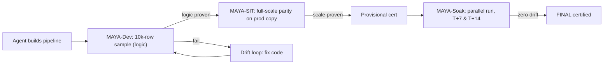

# MAYA - Migration Accelerator

[](https://github.com/srinivasnelakuditi/maya-migrate/actions/workflows/ci.yml)
[](LICENSE)
[](pyproject.toml)

**MAYA** turns a data-platform migration (e.g. **Azure Synapse -> Databricks**) into a
**deterministic, reviewable engineering process** instead of an artisanal rewrite. It
reads your exported source metadata, builds one normalized dependency graph, computes a
provable build order, emits a per-pipeline build contract, and proves every rebuilt table
against the source with a strict, three-phase parity gate.

The name says how the validation works. *Maya* means "illusion": in dev you build against a
small **illusion of production** - every table, but only a few thousand rows each - so you
prove the logic is correct cheaply, and only then prove it at full scale on
production-copied data. Then both systems run in parallel and MAYA re-proves parity over
time, because a pipeline that matches at cutover can still **drift** a week later.

> Everything in this repo is source-agnostic core + a reference Synapse adapter + a fully
> runnable synthetic demo (**Northwind**). No customer data, no credentials, no live
> connections required.



## 60-second quickstart (the Northwind demo)
```bash
git clone https://github.com/srinivasnelakuditi/maya-migrate
cd maya-migrate
pip install -r requirements.txt        # reportlab, pypdf, PyYAML

make demo     # graph -> order -> verify -> context -> sample -> validate -> report -> bi
make test     # the deterministic goldens for the demo
```
`make demo` runs the whole pipeline on `examples/northwind/` (a fictional retailer moving
Synapse -> Databricks) and writes every artifact to `examples/northwind/out/`:
a normalized graph, a verified 5-wave build order, per-pipeline contracts, RI-preserving
dev sample SQL, MAYA parity SQL for dev/sit/soak, and a branded PDF report.

Run a single phase yourself:
```bash
python3 cli.py graph    --config examples/northwind/northwind.yaml
python3 cli.py order    --config examples/northwind/northwind.yaml
python3 cli.py verify   --config examples/northwind/northwind.yaml
python3 cli.py context  --config examples/northwind/northwind.yaml
python3 cli.py maya sample --config examples/northwind/northwind.yaml --pipeline nw_build_sales
python3 cli.py validate --config examples/northwind/northwind.yaml --pipeline nw_build_marts --env soak
python3 cli.py report   --config examples/northwind/northwind.yaml
```

## The MAYA validation technique (two-phase + sustained soak)
| Phase | Data | Proves | Cost |
|---|---|---|---|
| **MAYA-Dev** | every table, sampled to N rows (default 10k) | logic is correct: schema, keys, referential integrity, no-extra-output, idempotency, transform spot-checks | tiny |
| **MAYA-SIT** | production-copied data (full volume) | full-scale parity: all 10 checks incl. row-count, checksum, aggregates, point-in-time (**provisional cert**) | paid once, when logic is already right |
| **MAYA-Soak** | live parallel loads at T+7 & T+14 | **sustained** parity: all 10 on the cumulative table **and** the incremental delta, so slow incremental-logic drift is caught (**final cert**) | two scheduled runs per window |

**Gate rule:** MAYA-Dev AND MAYA-SIT green earns a **provisional** certification; the
pipeline then runs in parallel with the source and must re-prove parity at every soak
window (default T+7, T+14) with **zero drift** for **final** certification. Point-in-time
parity proves *state*; the soak proves the *ongoing incremental logic* stays equal over
time. Sampling is referential-integrity-preserving (seed rows + foreign-key closure) so
joins actually resolve on the sample.

## How it works
1. **Adapter** parses your exported source into a normalized graph (`objects.csv` / `edges.csv`).
2. **Order** computes a topological build order (waves) via Tarjan SCC + longest-path layering.
3. **Verify** re-derives the order with *different* algorithms (Kosaraju + memoized DFS + Kahn) and proves it correct - an independent check, not a rubber stamp.
4. **Context** emits a deterministic per-pipeline contract: prereqs, produced tables (tagged bronze/silver/gold), parity targets, reachable procs, and a data-flow diagram.
5. **Engines (E1-E7)** - most pipelines are configuration + SQL, not bespoke code.
6. **MAYA sample / validate** - build the illusion of prod, then prove parity dev -> sit -> soak.
7. **Report** - a branded PDF summarizing waves, engines, parity, and connections.

## What is reusable vs per-source
| Reusable core (this repo) | Per-source adapter (you implement) |
|---|---|
| graph model, build order + independent verifier | collect the source artifacts |
| contract + classifier, engine catalog (E1-E7) | parse artifacts -> normalized graph |
| MAYA sampler + 3-phase parity framework | index source DDL |
| agent orchestration, BI migration | extract connection inventory |
| branded PDF reports + dashboard DDL | dialect translate (source SQL -> Spark) |

Roughly 70-80% of a migration is the reusable core; 20-30% is the adapter. See the
[adapter authoring guide](docs/12_adapter_authoring_guide.md).

## Repo layout
```
core/               source-agnostic library (graph, order, contract, engines,
                    validation, maya, bi, orchestration, branding, reports)
adapters/           SourceAdapter ABC + reference Synapse adapter; BI connectors
templates/          project/engine/maya/bi config, dashboard DDL, agent prompts
examples/northwind/ the runnable synthetic demo (graph, DDL, config, BI export)
docs/               methodology, MAYA validation, execution plan, guides
docs/tutorial/      hands-on walkthrough (01-10) using the Northwind demo
tests/              pytest suite asserting the Northwind goldens
blog/               "Migrating with MAYA" hands-on article series + figures
cli.py              phase entrypoint
```

## Documentation
- **New here?** Do the hands-on tutorial: [docs/tutorial/](docs/tutorial/README.md) (10 parts, built on Northwind).
- **The method:** [docs/01_methodology.md](docs/01_methodology.md).
- **The validation technique:** [docs/08_maya_two_phase_validation.md](docs/08_maya_two_phase_validation.md) and [docs/07_validation_framework.md](docs/07_validation_framework.md).
- **BI migration + Genie AI/BI:** [docs/13_bi_layer_migration.md](docs/13_bi_layer_migration.md).
- **Onboard a new source:** [docs/12_adapter_authoring_guide.md](docs/12_adapter_authoring_guide.md).

## Running it on your estate
Point an adapter at your exported metadata and copy `templates/project_config.example.yaml`
to `my_project.yaml`. The reference **Synapse** adapter is implemented; other sources
(ADF, Informatica, SSIS, Teradata, Oracle, dbt, ...) are adapter work following the same
normalized-graph contract.

## Contributing
Contributions welcome - see [CONTRIBUTING.md](CONTRIBUTING.md) and the
[Code of Conduct](CODE_OF_CONDUCT.md). Keep the core source-agnostic and deterministic;
new adapters should ship with a small synthetic example like Northwind.

## License
[Apache-2.0](LICENSE). "Databricks" and "Azure Synapse" are trademarks of their
respective owners; this project is not affiliated with either. See [NOTICE](NOTICE).

Created by **Srinivas Nelakuditi**.
