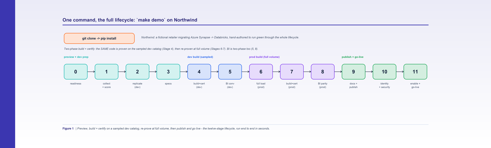

*Figure 1. MAYA turns a migration into a deterministic pipeline you can clone and run end to end in seconds.*

**By Srinivas Nelakuditi**  |  Creator of MAYA - an open-source, deterministic migration accelerator

*Migrating with MAYA - Part 1 of 10*

# Deterministic migration is open source - meet Northwind

Most platform migrations are run like art projects. A talented team rewrites pipelines
by hand, validates "the important ones," and hopes the numbers hold. It works until it
doesn't - and you find out weeks later, in production, when a report quietly disagrees
with the system it replaced.

MAYA takes the opposite stance: a migration should be a **deterministic pipeline**, not
an artisanal rewrite. Same inputs, same outputs, every time. Today I'm open-sourcing the
whole thing under Apache-2.0, and this 10-part series will walk the entire workflow on a
small, fully runnable demo you can clone right now.

## The 60-second version

```bash
git clone https://github.com/vasutechgenie/maya-migrate-to-databricks
cd maya-migrate-to-databricks
pip install -r requirements.txt
make demo
```

`make demo` runs MAYA's **six gated stages** against a bundled example and writes every
artifact to `examples/northwind/out/`: a normalized dependency graph and independently
verified build order, a 100% traversability score, a whole-estate test-catalog
replication script filled with referential-integrity synthetic data, one spec PDF per
pipeline, the swarm-built and topologically certified `gates.json`, the migrated BI layer
(Lakeview/Genie), and full generated docs. It runs with the deterministic **offline agent
driver**, so there's no cloud account, no credentials, and no live source system
required.

## Meet Northwind

The demo is **Northwind**, a fictional retailer moving from Azure Synapse to Databricks.
It's deliberately small but realistic: eight pipelines, around twenty-five tables and
views, four external connections, and a clean multi-wave dependency structure. It has an
orchestrator that fans out to children, a metadata-driven ingestion job, a file-intake
job, an external "invoke-in-place" job, a chain of SQL transforms across bronze / silver
/ gold, and a replication job to a serving layer. In other words, the same shapes you
meet on a real estate - just synthetic, so it's safe to publish and safe to break.

Northwind isn't just a toy for the blog. It's also the project's **test fixture**: the
pytest suite asserts on Northwind's exact waves, classifications, and parity targets, so
the examples in these posts are guaranteed to stay true as the code evolves.

## The six stages

Everything MAYA does is a function of one normalized graph, and it runs as **six
hard-gated stages**. Each stage runs its work, evaluates a gate, and refuses to advance
until that gate is green - so the estate is only ever built on a foundation that already
proved out. `make demo` runs all six with `maya run --stage all`:

1. **Collect + score** - parse the source into a graph, order it into waves, derive a
   contract per pipeline, and score the estate: every pipeline must be 100% traversable
   and every table, view, and external system identified.
2. **Replicate** - replicate every table and view into a Databricks test catalog, filled
   with referential-integrity-preserving data (synthetic 10k, or sampled from source).
3. **Specs** - render one branded build-spec PDF per pipeline.
4. **Build + certify** - a swarm of AI coding agents builds the *real* pipelines wave by
   wave, proves each on the synthetic dev catalog, then certifies in strict topological
   order (a pipeline certifies only after its predecessors do).
5. **BI** - migrate the dashboards end to end: extract, convert to Databricks SQL, prove
   result-for-result parity, republish, and replicate as Lakeview + Genie.
6. **Docs + publish** - generate full documentation for every pipeline, table, view, and
   dashboard, and publish it back to the repo.

MAYA drives the build/validate/fix work in stages 4-5 through an **agent driver**: the
demo uses a deterministic *offline* backend (no LLM, no network) so the whole thing is
reproducible; point it at the *Cursor* backend to drive real LLM coding agents on your
own estate.

The thing I care most about is that none of this is guessed. The graph comes from the
source; the order is computed and independently checked; the contracts are derived, not
authored; the agents build inside those contracts; and certification is binary and
machine-verified - per pipeline, then for the whole system. The existing verbs (`graph`,
`order`, `verify`, `context`, `report`, `validate`, `certify`, `bi`) are all still there
as primitives the stages call under the hood.

## Why "MAYA"?

*Maya* means "illusion," and it names the validation trick at the heart of the tool. In
dev you build against a small **illusion of production** - every table, but only a few
thousand rows each - so you prove the logic is correct cheaply. Only then do you prove it
at full scale on production-copied data. And because a pipeline that matches at cutover
can still drift a week later, MAYA then runs both systems in parallel and re-proves parity
over time. We'll get deep into all three phases later in the series.

## Where we're headed

Over the next nine parts we'll follow Northwind through all six stages: how MAYA reads
any source and scores it 100% traversable, how it builds and verifies the dependency graph
and the wave plan, how the per-pipeline contract is derived, how seven reusable engines
cover the estate, how the agent swarm builds it wave by wave against a replicated test
catalog, and how the three-phase parity gate (Dev, SIT, and the sustained Soak) certifies
each table in topological order - up to the whole-system certification that declares the
migration complete. We'll finish with the live dashboard, BI/Genie migration, generated
docs, and cutover - and how to point MAYA at your own estate.

If you want to read ahead, the repo has a durable, versioned version of this same
walkthrough under `docs/tutorial/`. But the best way to follow along is to clone it and run
`make demo` as you read.

**Part 1 of 10 - Migrating with MAYA.** Next up, Part 2: "The Adapter Model". The whole framework is open source - clone it and run `make demo`.
