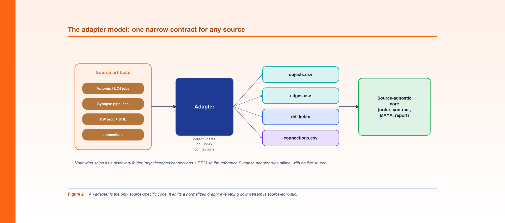

*Figure 2. An adapter is the only source-specific code; it emits a normalized graph, and everything downstream is source-agnostic.*

**By Srinivas Nelakuditi**  |  Creator of MAYA - an open-source, deterministic migration accelerator

*Migrating with MAYA - Part 2 of 10*

# The adapter model: how MAYA reads any source

The fastest way to make a migration tool useless is to hard-code it to one source system.
MAYA avoids that with a single idea: **everything source-specific lives in an adapter, and
everything else operates on a normalized graph.** Roughly 70-80% of a migration is the
reusable core; 20-30% is the adapter you point at your estate.

## The contract an adapter must satisfy

An adapter does five small things:

- `collect()` - make sure the raw source artifacts are present.
- `parse()` - emit the normalized graph as `objects.csv` + `edges.csv`.
- `ddl_index()` - map `schema.table -> [columns]` from CREATE TABLE DDL.
- `connections()` - inventory external connections.
- `dialect_translate()` - assistive source-SQL -> Spark SQL rewrites.

That's the whole interface. If you can produce those from your source - Synapse + Automic,
ADF, Informatica, SSIS, Teradata, Oracle, dbt - the entire rest of MAYA just works, because
nothing downstream knows or cares where the graph came from.

## The two CSVs that everything depends on

The normalized graph is two files with fixed columns. `objects.csv` lists every pipeline,
table, view, and stored proc. `edges.csv` lists the relationships between them using a
small, canonical vocabulary: `READS_TABLE`, `WRITES_TABLE`, `CALLS_PROC`,
`EXECUTES_PIPELINE`, `READS_CONFIG`, and a couple more. That's it. A pipeline that reads
three tables and writes two is just five edges.

This is the crucial design decision. By collapsing every source system into the same tiny
schema, MAYA makes ordering, contracts, sampling, validation, and reporting completely
source-independent. Write the adapter once; reuse everything else forever.

## The fast-path: run offline, today

Real adapters parse messy artifacts - XML job definitions, ARM templates, T-SQL. That work
is a mechanical lift, and you don't want to block on it to see value. So the reference
Synapse adapter supports a **fast-path**: point it at a discovery folder that already
contains `objects.csv` / `edges.csv` / `connections.csv`, and MAYA runs end to end
immediately.

That's exactly how Northwind ships. Look under `examples/northwind/` and you'll find the
discovery CSVs plus a small tree of CREATE TABLE files under `artifacts/DW/...`. The demo's
config just points the adapter at that folder:

```yaml
adapter: adapters.synapse.adapter.SynapseAdapter
home_database: northwind
adapter_options:
  source_dir: examples/northwind
  artifacts_dir: examples/northwind/artifacts
```

Run the first phase and watch the adapter turn that folder into the graph:

```bash
python3 cli.py graph --config examples/northwind/northwind.yaml
# graph: 33 objects, 42 edges -> .../examples/northwind/out/objects.csv
```

## Home database vs. external systems

One small but important field: `home_database`. It tells MAYA which database you actually
own the code for. Anything in another database is treated as **external** - something you
invoke in place rather than rebuild. In Northwind, `home_database: northwind` means the
`ext_erp`, `ext_web`, and `ext_fin` systems are boundaries, not build targets. That single
distinction later drives how a pipeline like `nw_fx_sync` (which calls an external proc) is
classified and handled.

## Why this matters

When people say "AI will just convert our pipelines," they skip the hard part: the tool
has to *understand* the estate first. The adapter model is how MAYA earns that
understanding cheaply and consistently. It reduces the per-source cost to one small, well-
defined component, and it makes the demo, the tests, and your real migration all speak the
same language.

Next up, we'll take those two CSVs and turn them into something you can reason about: the
Northwind dependency graph.

**Part 2 of 10 - Migrating with MAYA.** Next up, Part 3: "Building the Dependency Graph". The whole framework is open source - clone it and run `make demo`.
