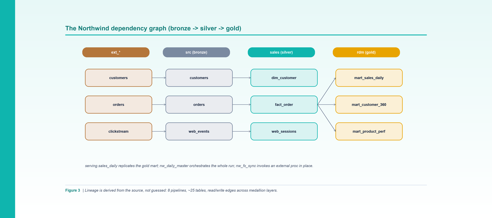

*Figure 3. Lineage is derived from the source, not guessed: pipelines and tables as read/write edges across the medallion layers.*

**By Srinivas Nelakuditi**  |  Creator of MAYA - an open-source, deterministic migration accelerator

*Migrating with MAYA - Part 3 of 10*

# Building the dependency graph

Ask ten engineers what your platform actually does and you'll get ten partial answers. The
real answer is a graph: which jobs read which tables, which tables feed which, where the
external boundaries are, and where the cycles hide. MAYA makes that graph the **single
source of truth** - every later phase is a pure computation over it.

## What the graph contains

After Part 2's `graph` phase, Northwind resolves to 33 objects and 42 edges. The objects
are 8 pipelines, a couple dozen tables and views, a config table, and one external stored
proc. The edges are the relationships between them. In code, the graph exposes exactly the
queries the rest of MAYA needs:

- `reads` / `writes` - table-name sets per pipeline (including reachable procs).
- `calls` - the transitive stored-proc closure.
- `exec_pipe` - which pipelines an orchestrator fans out to.
- `config_reads` - control/metadata tables a pipeline consults.

## Northwind's shape

The estate reads cleanly across the medallion layers:

- **ext_*** - external source systems (ERP tables, a web clickstream feed). Read-only.
- **src** (bronze) - landed copies produced by the ingestion jobs.
- **sales** (silver) - conformed dimensions and the order fact.
- **rdm** (gold) - the marts: daily sales, customer-360, product performance.
- **serving** - a replicated copy of the daily mart for downstream tools.

`nw_ingest_erp` reads the ERP tables and a metadata control table, and writes the `src.*`
landing tables. `nw_build_sales` reads `src.*` and writes the `sales.*` dimensions and
fact. `nw_build_marts` reads `sales.*` and writes the `rdm.*` marts. `nw_qlik_replicate`
copies the daily mart to `serving`. `nw_daily_master` orchestrates the whole run, and
`nw_fx_sync` invokes an external FX proc in place.
## Why "derived, not drawn" is the whole point

You could draw this diagram by hand. The problem is that hand-drawn lineage rots the moment
someone changes a job, and it's never complete enough to compute on. MAYA's graph is
**derived from the source**, so it's exhaustive and current, and - critically - it's
machine-readable. That property is what lets the next phases be deterministic:

- the **build order** is a topological sort of this graph;
- the **contract** for each pipeline is read straight off its in/out edges;
- the **sample plan** follows foreign-key edges to preserve join integrity;
- the **report** counts nodes and edges to summarize the estate.

None of those steps guess. They compute.

## Peeking at the model

You don't need to open the CSVs to explore the estate - the later `context` and `order`
phases summarize it - but they're right there in `examples/northwind/` if you're curious.
`objects.csv` has one row per object with its type, layer, schema, and (for tables) the DDL
file that defines it. `edges.csv` has one row per relationship. Because the schema is tiny
and fixed, it's trivial to diff, review in a pull request, or generate from your own source.

## The external boundary

Notice what the graph does *not* try to rebuild. The `ext_*` tables and the `ext_fin` proc
sit outside `home_database`, so MAYA treats them as boundaries. This is how you avoid the
classic migration trap of dragging half of someone else's system into scope. The graph
makes the boundary explicit, and the classifier (Part 6) turns that into a concrete
handling decision: invoke in place, don't rebuild.

With a complete, computable graph in hand, the next question is the one that makes or breaks
a migration schedule: in what order do we build all this? That's the topological wave plan -
and the independent verifier that proves it's correct.

**Part 3 of 10 - Migrating with MAYA.** Next up, Part 4: "Build Order, Waves & the Independent Verifier". The whole framework is open source - clone it and run `make demo`.
