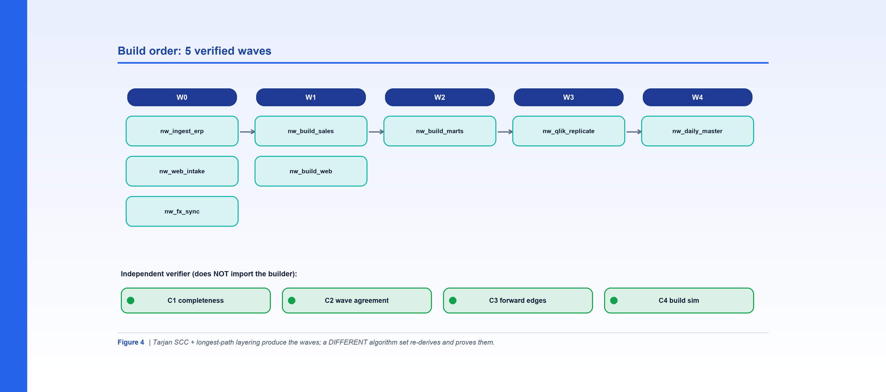

*Figure 4. Waves come from SCC + longest-path layering; a different algorithm set independently re-derives and proves them.*

**By Srinivas Nelakuditi**  |  Creator of MAYA - an open-source, deterministic migration accelerator

*Migrating with MAYA - Part 4 of 10*

# Build order, waves, and the independent verifier

Once you have a complete dependency graph, the next question decides your whole schedule:
what do we build first, and what can we build in parallel? Get it wrong and teams block
each other, rebuild on data that isn't ready, and discover cycles the hard way. MAYA answers
this by **computing** the order - and then proving the computation with an independent check.

## Waves, not a to-do list

Run the `order` phase on Northwind:

```bash
python3 cli.py order --config examples/northwind/northwind.yaml
# order: 22 tables in 5 waves; 8 pipelines in 5 waves
```

A "wave" is a set of things that can be built at the same time because none of them depends
on another in the same wave. Northwind lays out into five clean waves:

- **W0** - `nw_ingest_erp`, `nw_web_intake`, `nw_fx_sync` (nothing upstream).
- **W1** - `nw_build_sales`, `nw_build_web` (need the bronze landing tables).
- **W2** - `nw_build_marts` (needs the silver dimensions and fact).
- **W3** - `nw_qlik_replicate` (needs the gold mart).
- **W4** - `nw_daily_master` (the orchestrator, after its children).

The table-level order is primary - the real dependency is between tables - and the pipeline
waves are derived from it.
## The algorithms

The order is produced with **Tarjan's SCC** algorithm to collapse any cycles into single
units, followed by **longest-path layering** (a Kahn-style relaxation) to assign each unit
to a wave. Strongly-connected components matter: if two tables mutually depend, they must be
built as one unit, and the layering has to account for that. Northwind is intentionally
acyclic, so every component is a single table - but the machinery is there for the tangled
estates you meet in the wild.

## The part most tools skip: independent verification

Here's the discipline that makes me trust the output. The verifier **does not import the
builder.** It re-derives the waves from the graph using a *different* set of algorithms -
Kosaraju's SCC, a memoized-DFS longest path, and a Kahn peel to simulate the build - and
then checks the published order four ways:

```bash
python3 cli.py verify --config examples/northwind/northwind.yaml
#   C1_completeness: True
#   C2_wave_agreement: True
#   C3_forward_edges: True
#   C4_build_sim: True
# verify: PASS (22 tables, 5 waves)
```

- **C1 completeness** - the published tables exactly match the graph's tables.
- **C2 wave agreement** - the independently recomputed wave equals the published wave.
- **C3 forward edges** - every dependency points to an equal-or-later wave.
- **C4 build simulation** - a Kahn peel reaches every table, so there's no hidden cycle.

Two independent implementations agreeing is a much stronger guarantee than one
implementation asserting it's right. It's the difference between "the code says so" and
"two different pieces of code, written to disagree, agree."

## Why this earns real schedule confidence

A verified wave plan is what lets you parallelize safely. You can staff a wave with several
builders (human or agent) at once, knowing the barrier to the next wave only opens when the
current one is done and certified. And because the order is a pure function of the graph,
re-running after a source change re-plans deterministically - no tribal knowledge about
"the thing you have to build before the other thing."

This is also where migrations quietly go wrong without anyone noticing: someone builds a
mart on a dimension that wasn't finished, the numbers look plausible, and the error hides
until validation - or worse, production. Machine-checked forward edges make that class of
mistake structurally impossible.

We now know *what* to build and *in what order*. Next we'll derive *how* to build each
pipeline - the deterministic contract of needs, logic, and output.

**Part 4 of 10 - Migrating with MAYA.** Next up, Part 5: "The Deterministic Pipeline Contract". The whole framework is open source - clone it and run `make demo`.
