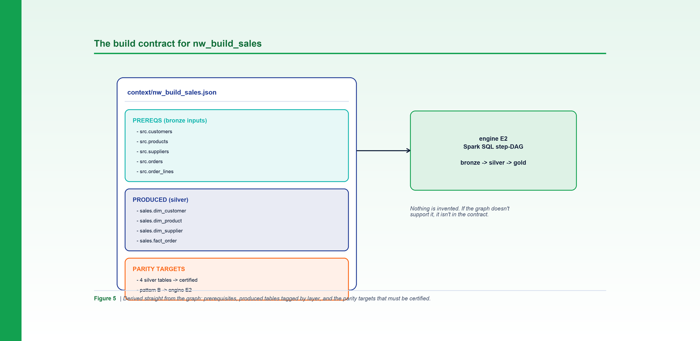

*Figure 5. The build contract is derived straight from the graph: prerequisites, produced tables by layer, and parity targets.*

**By Srinivas Nelakuditi**  |  Creator of MAYA - an open-source, deterministic migration accelerator

*Migrating with MAYA - Part 5 of 10*

# The deterministic pipeline contract

When you hand a pipeline to a builder - a person or an AI agent - the quality of the result
is capped by the quality of the brief. Vague briefs produce plausible-but-wrong rebuilds.
MAYA's answer is the **build contract**: a precise, machine-generated spec for each pipeline,
derived straight from the graph so it's complete and never invented.

## Generate the contracts

```bash
python3 cli.py context --config examples/northwind/northwind.yaml
# context: 8 contracts, 8 parity targets -> out/pipeline_specs/context
```

That writes one JSON contract per pipeline plus an index. Let's look at what a contract
actually contains, using `nw_build_sales`.

## Anatomy of a contract

Every contract has three sections, each read directly off the graph:

- **Needs (prerequisites).** The tables the pipeline reads but does not produce - its bronze
  landing set. For `nw_build_sales`: `src.customers`, `src.products`, `src.suppliers`,
  `src.orders`, `src.order_lines`.
- **Logic.** The pattern and engine the pipeline maps to (more on engines in Part 6), plus
  its reachable stored procs and a bronze -> silver -> gold data-flow sketch.
- **Output (produced).** Every table it writes, each tagged with a medallion **layer**.
  `nw_build_sales` produces four `sales.*` tables, all classified **silver**.

From the output, MAYA computes the **parity targets**: the persisted silver and gold tables
that must be certified against the source. For `nw_build_sales`, that's all four silver
dimensions and the fact. For an ingestion job that only lands bronze, it's zero - bronze is
a copy, not a transform, so there's nothing to prove yet.

## Layers are computed, not guessed

The medallion layer of each table comes from a simple, configurable schema map. In
Northwind's config:

```yaml
schema_layers:
  src: bronze
  sales: silver
  rdm: gold
  serving: serving
  metadata: config
```

So `sales.dim_customer` is silver and `rdm.mart_sales_daily` is gold - automatically. This
is what lets the tool decide, per table, whether it's a parity target and how rigorously to
validate it. Change the map, and the classification follows; nothing is hard-coded.

## DDL columns come along for free

Because the adapter built a DDL index (Part 2), each parity target in the contract carries
its **column list**. Open `nw_build_sales.json` and `sales.dim_customer` lists
`customer_key`, `customer_id`, `region`, and so on. That's not cosmetic: those columns
become the inputs to the parity SQL in the validation phases - the checksum, the aggregate
reconciliation, the schema comparison. The contract is the bridge between "what exists in
the source" and "what we'll prove about the rebuild."

## "No partial credit" starts here

The contract is also a completeness gate. A pipeline is only buildable when its needs,
logic, and output are fully resolved. If a prerequisite table has no known DDL, or an output
can't be classified, that's surfaced as missing - **named, not assumed.** This is the same
philosophy that runs through the whole tool: it would rather tell you exactly what it
doesn't know than paper over it and let the gap explode later.

## Why derived contracts beat written ones

Hand-written specs drift from reality and reflect one person's mental model. A derived
contract is exhaustive (it can't forget a table the graph knows about), consistent (every
pipeline is described the same way), and cheap (regenerated in seconds after any source
change). It's the artifact that makes the build phase boring in the best possible way: the
builder isn't reverse-engineering intent, they're implementing a precise spec against a
known set of parity targets.

Speaking of the build - most pipelines don't need bespoke code at all. In the next part
we'll see how a deterministic classifier collapses the whole Northwind estate onto a handful
of reusable engines.

**Part 5 of 10 - Migrating with MAYA.** Next up, Part 6: "Reusable Engines E1-E7". The whole framework is open source - clone it and run `make demo`.
