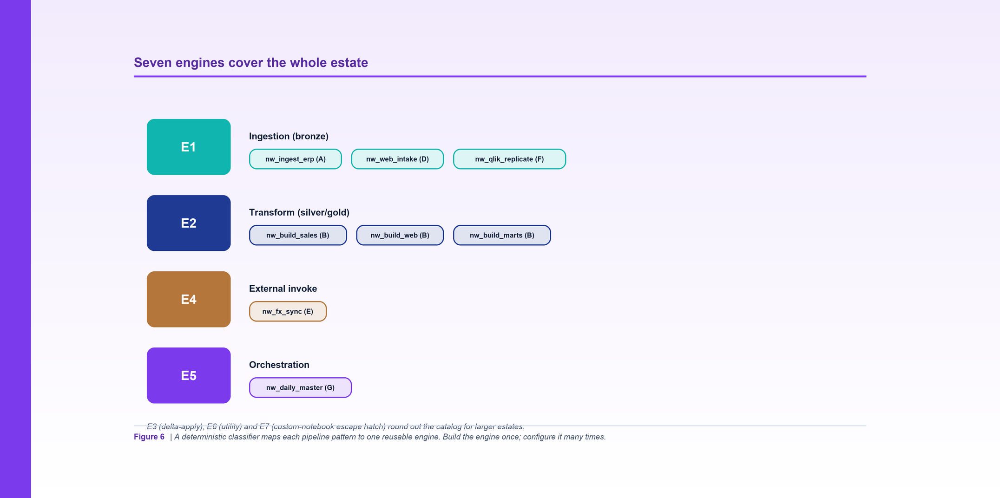

*Figure 6. A deterministic classifier maps each pipeline pattern to one reusable engine - build the engine once, configure it many times.*

**By Srinivas Nelakuditi**  |  Creator of MAYA - an open-source, deterministic migration accelerator

*Migrating with MAYA - Part 6 of 10*

# Reusable engines E1-E7, SQL-first

The biggest waste in a migration is treating every pipeline as a unique snowflake. Most of
them aren't. Strip away the names and you find the same half-dozen shapes repeating: land
some data, transform it with SQL, apply deltas, invoke something external, orchestrate
children. MAYA leans on that: a **deterministic classifier** maps each pipeline to one of
seven reusable engines. You build the engine once and configure it many times.

## The classifier is a pure function

During the `context` phase, each pipeline is classified into a **pattern** (A-G) from
signals already in the graph: which control/metadata tables it reads, whether it writes to a
serving schema, whether it calls an external proc, whether it fans out to sub-pipelines, and
name hints. That pattern maps to an **engine** (E1-E7). Because it's derived from the graph,
the classification is reproducible and reviewable - not a judgment call.

Here's how Northwind's eight pipelines land (straight from `out/pipeline_specs/index.json`):

| Pipeline | Pattern | Engine | What it is |
|---|---|---|---|
| `nw_ingest_erp` | A | **E1** | metadata-driven ingestion |
| `nw_web_intake` | D | **E1** | file / document intake |
| `nw_qlik_replicate` | F | **E1** | replication / CDC serving |
| `nw_build_sales` | B | **E2** | stored-proc transform chain |
| `nw_build_web` | B | **E2** | transform |
| `nw_build_marts` | B | **E2** | transform |
| `nw_fx_sync` | E | **E4** | external invoke-in-place |
| `nw_daily_master` | G | **E5** | orchestrator fan-out |

Eight pipelines, four engines. On a real estate with hundreds of jobs, that collapse is the
difference between a year and a quarter.

## The engine catalog

The full catalog is seven engines:

- **E1 - Ingestion (bronze):** JDBC extract, file intake, CDC snapshot, metadata multi-ingest.
- **E2 - Transform (silver/gold):** Spark SQL step-DAG; dynamic-SQL expansion.
- **E3 - Delta-Apply:** SCD / MERGE / dynamic deltas.
- **E4 - External-Invoke:** invoke in place (JDBC exec, proc, file transfer).
- **E5 - Orchestration:** run child jobs.
- **E6 - Utility / Maintenance:** copy, retention, dedup, no-op.
- **E7 - Custom Notebook:** the deliberate escape hatch for the genuine one-offs.

E7 matters as much as the others. Every estate has a few pipelines that don't fit a pattern,
and pretending otherwise is how frameworks become straitjackets. MAYA names the escape hatch
explicitly so the exceptions are visible and few, not smuggled in everywhere.

## SQL-first, on purpose

Notice that the transform engine (E2) is Spark **SQL**, not hand-written PySpark for each
job. Most Synapse/warehouse logic is SQL already, so the migration is mostly translation and
configuration, not reinvention. Engines are configured with small per-pipeline YAML - which
sources to land, which SQL steps to run, which parity tables to certify - rather than bespoke
code. The `templates/engine_config.example.yaml` in the repo shows the shape.

## External and orchestration: not everything is a rebuild

Two of Northwind's pipelines are reminders that migration is not only rebuilding. `nw_fx_sync`
is pattern E: it calls a proc in an external system (`ext_fin`), which sits outside
`home_database`, so the right move is to **invoke it in place**, not drag it into scope.
`nw_daily_master` is pattern G: it produces nothing itself; it orchestrates the other jobs,
so it maps to the orchestration engine. The classifier gets both right from the graph alone.

## Why this is the leverage point

Contracts (Part 5) tell you exactly what each pipeline must do. Engines turn that into
implementation leverage: effort shifts from writing N pipelines to configuring seven engines.
It's also what makes an agent pool effective - agents fill in engine configs against a precise
contract and a known set of parity targets, rather than free-forming bespoke code you then
have to review line by line.

Which brings us to the real question: how do we *prove* a rebuilt pipeline is correct without
spending a fortune? That's MAYA's validation technique - starting with the illusion of
production.

**Part 6 of 10 - Migrating with MAYA.** Next up, Part 7: "MAYA-Dev: the Illusion of Production". The whole framework is open source - clone it and run `make demo`.
