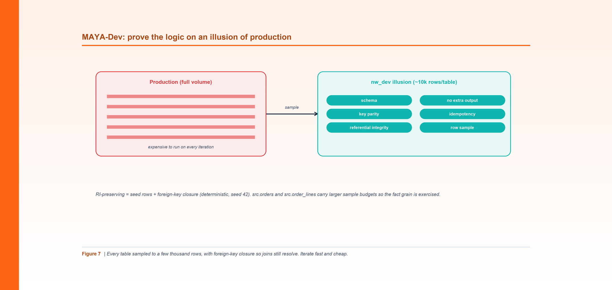

*Figure 7. Prove the logic on a small illusion of production - every table sampled with foreign-key closure so joins still resolve.*

**By Srinivas Nelakuditi**  |  Creator of MAYA - an open-source, deterministic migration accelerator

*Migrating with MAYA - Part 7 of 10*

# MAYA-Dev: the illusion of production

Here's the expensive mistake almost every migration makes: proving correctness by running the
new pipeline on full production volume, over and over, through every fix. Full-scale compute
on every iteration - while the logic is still wrong - is where validation budgets go to die.

MAYA's answer, and the reason for the name, is the **illusion of production**. In dev you build
a small copy of production - every table, but only a few thousand rows each - and prove the
*logic* there, cheaply. Only once the logic is right do you spend money proving it at scale.
This part is about that first phase: **Stage 4, build+certify-dev** (`--env dev`) - the dev
half of MAYA's two-phase build+certify. The same code you certify here is what gets re-proven
at full volume in Stage 7; nothing is rewritten between the two.

## The catch with naive sampling

You can't just `LIMIT 10000` each table. If you sample orders and customers independently,
half your order rows will reference customers that aren't in the sample, and every join
silently drops rows. Your "correct" transform then looks wrong for reasons that have nothing
to do with the logic. Sampling has to **preserve referential integrity.**

## RI-preserving sampling

MAYA samples in two steps. First it takes a deterministic seed sample of each table (ordered
by key, hashed with a fixed seed so it's reproducible run to run). Then it walks the
foreign-key edges and pulls in any parent rows referenced by the sampled children - the
**FK closure** - so every join resolves on the sample. Reference and config tables (small
dimensions, control tables) are copied whole.

Generate the plan for a Northwind pipeline:

```bash
python3 cli.py maya sample --config examples/northwind/northwind.yaml --pipeline nw_build_sales
# maya sample: 5 tables across 1 pipeline(s) -> out/maya_sample.sql, out/maya_sample_manifest.csv
```

The pipeline's five bronze prerequisites become five sample specs. `src.orders` and
`src.order_lines` carry larger sample budgets (from `sample_overrides` in the config) so the
fact grain is genuinely exercised, and the FK closure guarantees that every sampled order
line points at a product and customer that exist in the sample.
## Determinism is a feature

The sampling seed is fixed (42 in the demo). That's deliberate: a dev sample that changes
every run makes idempotency checks meaningless. With a fixed seed, the same dev sample is
reproducible, so "re-run yields identical output" is a check you can actually trust. The
manifest (`maya_sample_manifest.csv`) records exactly what dev should contain - table, kind,
row budget, keys, seed - so the illusion is auditable, not magic.

## What MAYA-Dev proves (and what it defers)

MAYA-Dev runs only the **volume-independent** checks, because volume-dependent ones are
meaningless on a sample:

- schema parity (columns, order, types, nullability),
- key parity (no missing / extra / duplicate keys on the sample),
- referential integrity (FKs resolve to certified parents),
- no-extra-output (only the contract's tables/columns appear),
- idempotency (re-run is byte-identical),
- a row-level sample diff (failing keys enumerated old-vs-new).

Row counts, checksums, and aggregate reconciliation at full volume are explicitly **deferred
to the full-volume phase** (Stage 7, `--env sit`) - there's no point comparing a 10k-row sum
to a billion-row sum. You can render the dev-phase plan for any pipeline with
`cli.py validate --env dev`.

## Why this changes the economics

The many iterations of a migration - the drift-loop passes where you find and fix the subtle
logic differences - all happen here, on a few thousand rows. Full-volume compute is incurred
**once**, later, when the logic is already correct. Same rigor on the parts that depend on
logic; a fraction of the compute. That's the whole trick, and it's why "prove it cheap, then
prove it at scale" is a technique and not just a slogan.

Of course, sampled logic proof isn't the end. A pipeline that's correct on 10k rows still has
to be correct on the real thing. That's the second phase of build+certify - **Stage 7**, run
at full volume (`--env sit`): the same code, ten-check parity, and the drift loop that runs
when a check goes red.

**Part 7 of 10 - Migrating with MAYA.** Next up, Part 8: "MAYA-SIT: 10-Check Parity & the Drift Loop". The whole framework is open source - clone it and run `make demo`.
