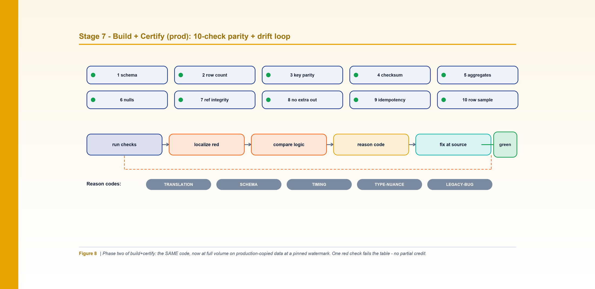
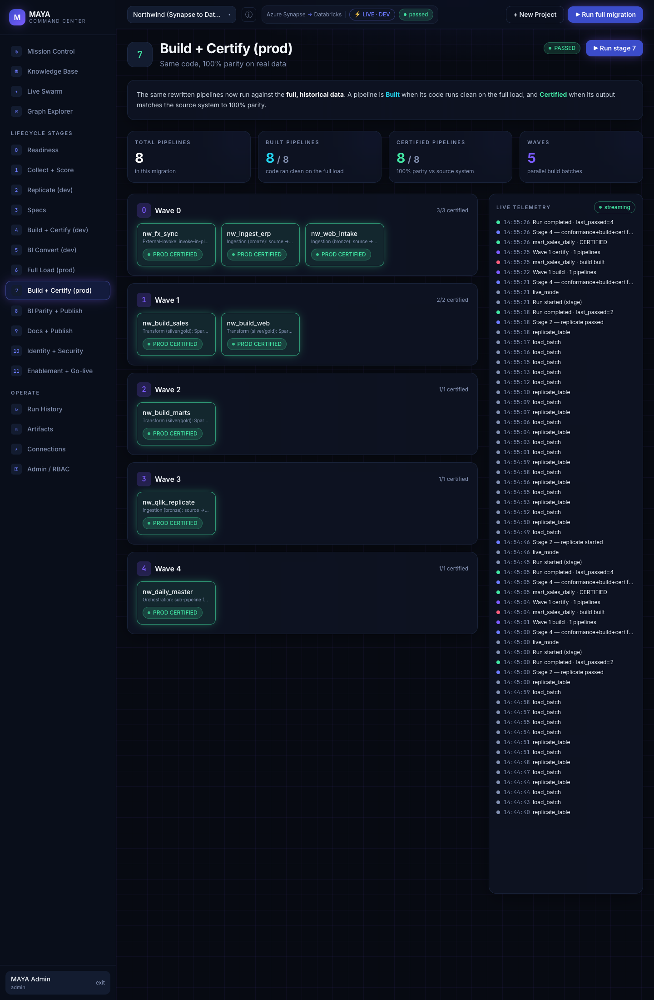

*Figure 8. Full-scale parity across ten checks at a pinned watermark; one red check fails the table and opens the drift loop.*

**By Srinivas Nelakuditi**  |  Creator of MAYA - an open-source, deterministic migration accelerator

*Migrating with MAYA - Part 8 of 10*

# MAYA-SIT: 10-check parity and the drift loop

Once a pipeline's logic is proven on the sampled illusion of production (Stage 4), it has to be
proven at scale. That's the second phase of build+certify - **Stage 7, build+certify-prod**
(`--env sit`): the *same code*, now run at full volume against production-copied data, pinned to
a point in time, across ten checks - with **no partial credit.** One red check fails the table.
This is what MAYA-SIT does inside the twelve-stage lifecycle.

## Point-in-time is non-negotiable

You can't compare two moving systems. So MAYA freezes both to the same watermark - a load
timestamp - and compares like for like. Every check is rendered against that pinned point, so
"the numbers match" means "the numbers match as of the exact same load," not "roughly, if you
squint at slightly different snapshots."

## The ten checks

```bash
python3 cli.py validate --config examples/northwind/northwind.yaml --pipeline nw_build_marts --env sit
```

That renders executable SQL for each of the pipeline's parity targets:

1. **schema parity** - names, order, types, nullability, precision.
2. **row count** - totals (and per-partition) match.
3. **key parity** - the PK/business-key set is identical: no missing, extra, or dupes.
4. **content checksum** - an order-independent per-row hash, aggregated, matches.
5. **column aggregates** - SUM / MIN / MAX / COUNT-distinct reconcile per column.
6. **null distribution** - per-column null and distinct counts match.
7. **referential integrity** - FKs resolve to already-certified parents; no orphans.
8. **no extra output** - only the contract's tables and columns are produced.
9. **idempotency** - a re-run yields byte-identical output.
10. **row-level sample** - the first mismatching rows are enumerated old-vs-new.

The checksum check is the quietly clever one: hashing each row and summing the hashes makes
the comparison order-independent, so two tables with the same rows in different physical order
still match - and any single differing value flips the aggregate.



*Screenshot: Stage 7, Build + Certify (prod) - the same code, now run against full, historical data; a pipeline is certified only when its output matches the source system at 100% parity.*

*Note: the MAYA Command Center shown here is not a self-service product. To run MAYA on your estate, engage Databricks Professional Services or your Databricks FDE team, or contact srinivas.nelakuditi@databricks.com.*

## No partial credit

"99.9% of rows match" is not a pass. It's a defect with a blast radius, because the next wave
builds on this table. So certification is binary: all ten green, or the table is red. This
sounds harsh until you've debugged a downstream mart that inherited a 0.1% error from a
"basically fine" dimension three waves back.

## The drift loop

A red check isn't a verdict; it's the start of a **disciplined loop**:

1. **Run** the ten checks; note which is red.
2. **Localize** the failing check to specific keys/columns (that's what check 10 is for).
3. **Compare logic** - the source transform vs. the rebuilt one - at that exact spot.
4. **Assign a reason code** so the failure is classified, not hand-waved.
5. **Fix at the source of the logic** and re-validate. Repeat until green.

The reason-code taxonomy keeps the debugging honest: `TRANSLATION` (the rebuilt logic differs),
`SCHEMA` (type/order/nullability), `TIMING` (load-window / late rows), `TYPE-NUANCE`
(rounding, collation, timezone, decimal), `SOURCE-CHANGE` (the source changed since capture),
and the only permitted red: `LEGACY-BUG` - a confirmed defect in the source that a human signs
off to keep or fix. Everything else must go green.

## Why the loop matters more than the checks

Anyone can write ten comparison queries. The value is in what happens on a mismatch. Without a
loop, mismatches get "explained" and waived, and the migration accumulates quiet debt. With
the loop, every discrepancy is either fixed in code or explicitly, accountably accepted as a
legacy bug. The result is a table you can actually certify and build on.

Full-volume parity green (on top of the Stage 4 dev proof) earns a **provisional**
certification. Provisional, not final - because there's one more failure mode point-in-time
parity can't catch. A pipeline can match perfectly at cutover and still drift a week later, as
its incremental logic runs day after day. Catching that is the sustained-soak part of Stage 7 -
the step most migrations skip entirely - which earns the FINAL certification before go-live.

**Part 8 of 10 - Migrating with MAYA.** Next up, Part 9: "MAYA-Soak: Sustained Parity, Zero Drift". The whole framework is open source - clone it and run `make demo`.
