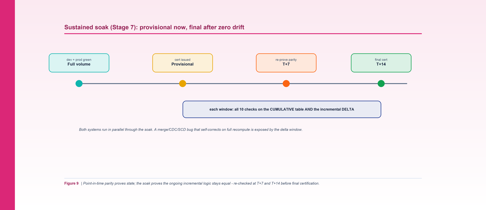

*Figure 9. Point-in-time parity proves state; the soak re-proves the ongoing incremental logic at T+7 and T+14 with zero drift.*

**By Srinivas Nelakuditi**  |  Creator of MAYA - an open-source, deterministic migration accelerator

*Migrating with MAYA - Part 9 of 10*

# MAYA-Soak: sustained parity, zero drift

This is the phase most migrations don't have, and it's the one that has burned me the most in
practice. You migrate a pipeline. You validate it. Every check is green. You cut over. And a
week later, the numbers have quietly diverged from the system you retired.

How? Because point-in-time parity proves **state** - the two tables are identical at one frozen
moment. It cannot prove that the **ongoing incremental logic** matches. Subtle differences in
how a MERGE, a CDC apply, an SCD update, or late-arriving data are handled don't show up at
cutover. They accumulate, load after load, until one day the drift is visible - and now it's a
production incident, not a validation finding.

## The idea: keep both systems running

The soak addresses this directly, and in the twelve-stage lifecycle it's the sustained part of
**Stage 7, build+certify-prod** (`--env soak`). After a pipeline earns its **provisional**
certification (the Stage 4 dev proof plus full-volume point-in-time parity green), both the old
and new systems keep running in parallel, and MAYA re-proves parity at scheduled checkpoints -
by default **T+7 and T+14 days**. Only when every soak window is green with **zero drift** does
the pipeline earn **final** certification and clear the path to Stage 11 go-live.

```bash
python3 cli.py validate --config examples/northwind/northwind.yaml --pipeline nw_build_marts --env soak
# MAYA-Soak parity plan ... sustained parallel-run parity at T+7, T+14 (cumulative + delta)
```

## Cumulative AND delta

Each soak checkpoint runs the full ten-check battery twice:

- on the **cumulative** table (the whole thing, as before), and
- on the **incremental delta** - just the rows loaded since the previous checkpoint.

That second one is the key. A broken incremental step can be masked by the cumulative
comparison, because a full recompute self-corrects the total even when the day-to-day apply is
wrong. The delta window can't be fooled that way: it isolates exactly the rows the incremental
logic produced in this window, so a merge or late-data bug shows up immediately instead of
hiding in the aggregate.

The delta is defined by watermark: `prev_watermark < load_dt <= now`. MAYA renders a dedicated
`soak_delta_parity` check for it - count and order-independent hash over just that slice, source
vs. build.

## New reason codes for a new failure mode

Soak drift has its own causes, so the taxonomy gains two codes:

- **INCREMENTAL-LOGIC** - the merge / CDC / SCD / upsert logic diverges over successive runs.
  Fix the incremental step, re-backfill the window, re-soak.
- **LATE-DATA** - late-arriving or out-of-order rows are handled differently over time. Align
  the late-data and watermark handling, re-soak.

These are exactly the bugs that never appear in a one-shot comparison and always appear in
production. Naming them makes them findable.

## The three-state gate

Put the whole technique together and certification is a small state machine:

- **BLOCKED** - the Stage 4 dev proof or the full-volume point-in-time parity is not yet green.
- **PROVISIONAL** - both green (build-time parity proven), soak in progress.
- **CERTIFIED** - both green **and** every soak window green (or soak not required).

The tool encodes this directly in its gate function, and the project's tests assert each
transition - blocked, provisional, and certified - so the rule can't silently rot. A pipeline
that matches at cutover but fails a soak window stays **provisional**; it does not get to claim
"done."

## Why this is the differentiator

Most migration tooling stops at point-in-time parity and calls it certified. That's optimistic
in a way that shows up as a support ticket. MAYA treats a migration as correct only when it has
been *sustainedly* correct - when the ongoing logic has been proven equal across real
production loads, not just at one frozen instant. It's a little more patience for a lot less
risk.

With pipelines certified for real, the last mile is operational: watching progress on a live
dashboard, migrating the BI layer, and cutting over. That's where we go in the finale.

**Part 9 of 10 - Migrating with MAYA.** Next up, Part 10: "Dashboard, BI/Genie & Cutover". The whole framework is open source - clone it and run `make demo`.
