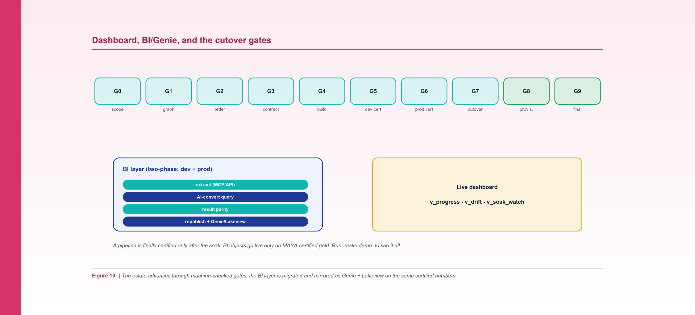
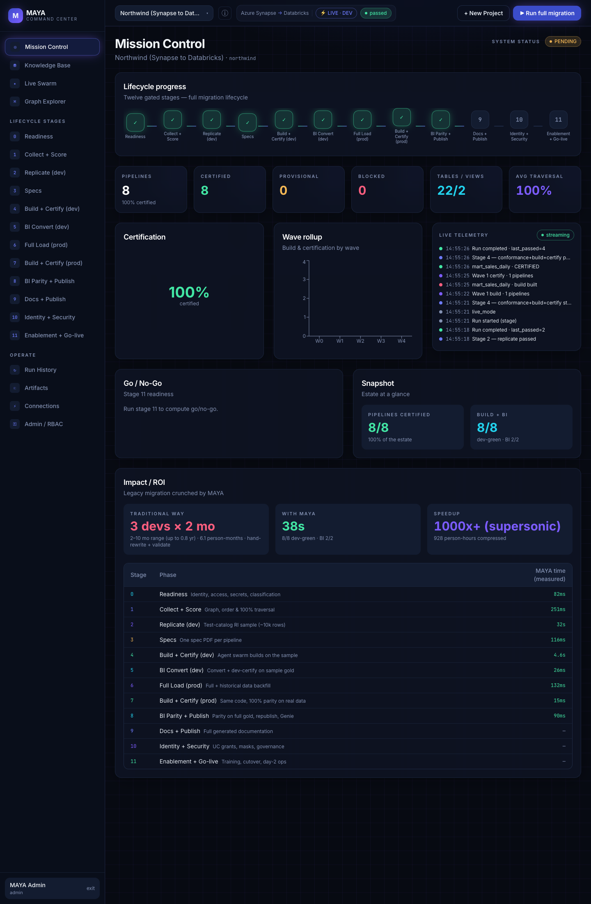
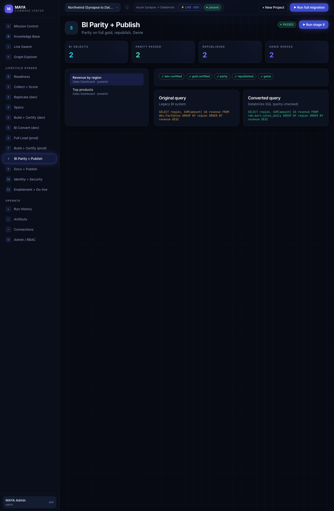

*Figure 10. The estate advances through machine-checked gates; the BI layer is migrated and mirrored as Genie + Lakeview on certified numbers.*

**By Srinivas Nelakuditi**  |  Creator of MAYA - an open-source, deterministic migration accelerator

*Migrating with MAYA - Part 10 of 10*

# Dashboard, BI/Genie, cutover - and your estate

We've taken Northwind from raw source metadata to certified Databricks tables. This finale is
about the operational last mile - seeing the whole migration at a glance, migrating the BI layer
on top of the certified data, cutting over through machine-checked gates - and then pointing MAYA
at your own estate.

## A migration you can watch

A migration with hundreds of pipelines needs a live view, not a spreadsheet. MAYA ships control
tables and dashboard views (see `templates/dashboard_control_tables.sql` and
`docs/11_dashboard.md`) that track every pipeline through the gates. The ones I watch:

- **v_progress** - pipelines by wave and state (blocked / building / provisional / soaking /
  certified).
- **v_drift** - open parity failures by reason code, so the team fixes causes, not symptoms.
- **v_soak_watch** - pipelines in soak, with their T+7 / T+14 due dates and drift status.

The gates run G0 (scope) through G9 (soak-certified) per pipeline, then a single **system gate
(S)** rolls all of them - plus the BI objects - across every wave into one verdict:
`MIGRATION_IN_PROGRESS -> SYSTEM_PROVISIONAL -> MIGRATION_COMPLETE`. So "how far along are we"
has an exact, defensible answer instead of a vibe - right up to "is the migration done?"



*Screenshot: Mission Control - the whole migration at a glance: twelve-stage progress, certified vs provisional counts, the wave rollup, live telemetry, and the traditional-vs-MAYA ROI.*

## Migrating the BI layer

Certified gold tables are only half the value - the dashboards on top have to move too, and they
have to show the *same numbers*. Like build+certify, BI is **two-phase**: MAYA dev-certifies the
converted dashboards on sampled gold (**Stage 5, bi-convert-dev**), then re-proves parity at full
volume and republishes (**Stage 8, bi-parity+publish-prod**). It runs as its own agent-driven
pipeline end to end:

```bash
python3 cli.py bi run --config examples/northwind/northwind.yaml
```

For each dashboard object the flow is: **extract** the query and datasource (over MCP/API, or an
offline export like Northwind's `bi_export/`), **AI-convert** the query to Databricks SQL repointed
at certified gold, **prove result parity** (schema, row count, set equality both ways, checksum,
order) with the same drift-loop discipline as data parity, **republish** to the BI tool, and
**replicate natively** as a Lakeview dashboard with an attached **Genie** space. A BI object is
done only when its converted query is result-for-result identical to the original, it's
republished, and its Genie + Lakeview replica exist - and BI work only starts once the gold tables
it reads are MAYA-certified.

That last point matters: it's how you avoid migrating a dashboard onto numbers that themselves
aren't proven yet.



*Screenshot: Stage 8, BI Parity + Publish - each dashboard's original query is converted to Databricks SQL, proven result-for-result identical, republished, and mirrored as a Genie space.*

*Note: the MAYA Command Center shown here is not a self-service product. To run MAYA on your estate, engage Databricks Professional Services or your Databricks FDE team, or contact srinivas.nelakuditi@databricks.com.*

## Generated docs, then go-live

**Stage 9 (docs+publish)** closes the loop on knowledge, not just data. Once everything is
certified and the BI layer is live, MAYA generates full documentation for every pipeline, table,
view, and dashboard - lineage, DDL, and the exact certification status pulled from `gates.json` -
and publishes it back to the repo:

```bash
python3 cli.py docs    --config examples/northwind/northwind.yaml
python3 cli.py publish --config examples/northwind/northwind.yaml
```

So the migrated estate ships with its own accurate, regenerated documentation - the opposite of
the stale wiki most migrations leave behind.

## Identity, security, and go-live

Certified data and docs still aren't a cutover. **Stage 10 (identity+security+governance)** applies
the Unity Catalog groups and grants, masking, and secrets the estate needs, and **Stage 11
(enablement+go-live)** covers training, runbooks, the cutover/rollback plan, and day-2 ops - the
human side of turning the new platform on.

Cutover itself is the payoff of everything before it. Because each table is certified and each wave
is built on certified data, cutover isn't a leap of faith - it's flipping consumers over to tables
that have already been proven equal, including through the soak. And you don't cut over on a hunch
that "everything's done": `maya certify` rolls every per-pipeline gate and every BI object into
one whole-system state, and only `MIGRATION_COMPLETE` clears the source for retirement:

```bash
python3 cli.py certify --config examples/northwind/northwind.yaml
python3 cli.py report  --config examples/northwind/northwind.yaml
```

The `report` phase produces a branded PDF summarizing waves, engines, parity, and connections
that's genuinely useful as the sign-off artifact.

## Running it on your estate

Northwind was the whole workflow in miniature. To run MAYA for real:

1. **Write (or reuse) an adapter** that emits the normalized graph, DDL index, and connections for
   your source. The reference Synapse adapter and `docs/12_adapter_authoring_guide.md` are the
   template; ship a small synthetic example alongside it, exactly like Northwind.
2. **Copy `templates/project_config.example.yaml`** to your own config: point it at your discovery
   folder, set your schema-to-layer map, your dev/sit catalogs, and your soak windows.
3. **Run the same twelve-stage lifecycle** you just watched with `maya run --stage all` - or drive
   each stage yourself - and finish with `maya certify` for the whole-system verdict. Set
   `agents.driver: cursor` (with a `CURSOR_API_KEY`) to have real LLM coding agents do the build.

Everything you saw in this series - the graph, the verified waves, the derived contracts, the seven
engines, the test-catalog replication, the two-phase build+certify (sampled dev, then full-volume
plus soak), the two-phase BI, and the whole-system certification - is source-agnostic. The only
thing that changes per source is the adapter.

## Thank you

That's the series. MAYA is open source under Apache-2.0, and the fastest way to understand it is
still the one from Part 1: clone the repo and run `make demo`. If you build an adapter for a new
source, or find a way to make the core sharper, contributions are genuinely welcome - the whole
point of open-sourcing this is to turn migration from an art into a shared, reusable engineering
practice.

**Part 10 of 10 - Migrating with MAYA.** That is the series - thank you for reading. New here? Start with Part 1: "MAYA is Open Source - Meet Northwind", or just clone the repo and run `make demo`.
