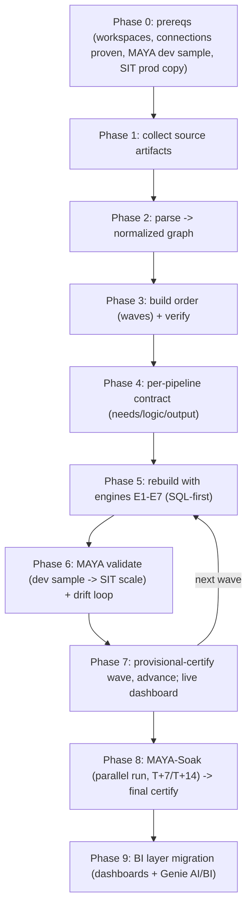

# 01 - MAYA methodology

MAYA turns a legacy-to-Databricks migration into a deterministic, mostly-autonomous
pipeline. The phases below take an estate from raw source artifacts to a
prod-certified Databricks lakehouse, with the MAYA two-phase validation technique
making the validation step cheap and the sustained soak making certification durable.

## The phases
1. **Collect** - the adapter gathers all source artifacts (code, procs, schedules,
   configs, DDL). See [12_adapter_authoring_guide.md](12_adapter_authoring_guide.md).
2. **Parse** - the adapter emits the normalized graph (`objects.csv` / `edges.csv`).
   Everything downstream is source-agnostic. See [03_graph_and_lineage.md](03_graph_and_lineage.md).
3. **Order** - topologically sort tables and pipelines into waves; verify with an
   independent validator. See [04_build_order.md](04_build_order.md).
4. **Contract** - derive a deterministic needs/logic/output contract per pipeline.
   See [05_pipeline_contract.md](05_pipeline_contract.md).
5. **Rebuild** - implement with the reusable engines E1-E7, SQL-first. See
   [06_engines.md](06_engines.md).
6. **Validate (MAYA)** - prove logic cheaply on the sampled dev illusion, then prove
   parity at scale on prod-copied SIT data; drift-loop until green. See
   [07_validation_framework.md](07_validation_framework.md) and
   [08_maya_two_phase_validation.md](08_maya_two_phase_validation.md).
7. **Provisionally certify + advance** - a wave advances only when every pipeline is
   provisionally certified (MAYA-Dev AND MAYA-SIT green). See
   [10_execution_plan.md](10_execution_plan.md).
8. **Soak + finally certify** - each pipeline runs in parallel with the source and
   re-proves parity at T+7 and T+14 (cumulative + incremental delta) with zero drift
   before final certification and source retirement. Point-in-time parity proves state;
   the soak proves the ongoing incremental logic. See
   [08_maya_two_phase_validation.md](08_maya_two_phase_validation.md).
9. **BI layer migration** - once the gold tables are certified, agents migrate the
   dashboards (Looker/Tableau/Power BI) over MCP/API: extract queries, AI-convert to
   Databricks, prove result-for-result parity, republish, and replicate as Lakeview +
   Genie for AI/BI. See [13_bi_layer_migration.md](13_bi_layer_migration.md).

## What makes it fast
- Determinism (nothing guessed), reusable engines (config + SQL, not bespoke code),
  an autonomous agent pool ([09_agent_orchestration.md](09_agent_orchestration.md)),
  and MAYA's cheap-first validation. A live dashboard
  ([11_dashboard.md](11_dashboard.md)) is the only thing a human watches.
