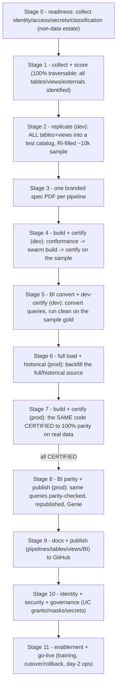
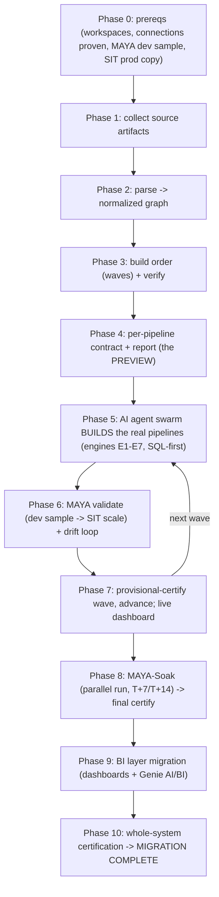

# 01 - MAYA methodology

MAYA turns a legacy-to-Databricks migration into a deterministic, mostly-autonomous
pipeline. The phases below take an estate from raw source artifacts to a
prod-certified Databricks lakehouse, with the MAYA two-phase validation technique
making the validation step cheap and the sustained soak making certification durable.

## The twelve gated stages

Operationally MAYA runs as **twelve hard-gated stages (0-11)**. Each stage runs its steps,
evaluates a gate, and the orchestrator refuses to advance past a failed gate. The stages
wrap the phases/gates described later in this doc - they do not replace them; every
existing verb (`graph`, `order`, `verify`, `context`, `maya sample`, `validate`,
`certify`, `report`, `bi`) still runs directly as a primitive.

The data + BI layers migrate across **two explicit phases** using the **same code**: a
**dev** phase on a ~10k referential-integrity-preserving sample (build+certify at stage 4,
BI convert + dev-certify at stage 5) and a **prod** phase on the full/historical load
(full load at stage 6, build+certify at stage 7, BI parity + publish at stage 8). Any prod
fix is persisted back to the single source of truth, so dev and prod never diverge.

| Stage | Command | Gate |
|---|---|---|
| 0 readiness | `maya readiness` | identity/access/secrets/classification collected + consistent |
| 1 collect + score | `maya score` (after `graph`/`order`/`context`) | every pipeline 100% traversable, every table/view identified, every external tagged call-as-is, order verifies |
| 2 replicate (dev) | `maya replicate` | every table AND view replicated into `maya.test_catalog` (synthetic ~10k w/ referential integrity, or sample-from-source) |
| 3 specs | `maya specs` | exactly one spec PDF per pipeline (+ omnibus) |
| 4 build + certify (dev) | `maya build` | order+specs conform; swarm builds dev-green; every pipeline CERTIFIED on the sample, in topological order |
| 5 BI convert + dev-certify (dev) | `maya run --stage 5` | every BI object converted + runs clean on the sample gold (no source parity/republish/Genie yet) |
| 6 full load + historical (prod) | `maya run --stage 6` | the full/historical source backfilled for every pipeline |
| 7 build + certify (prod) | `maya run --stage 7` | the SAME code CERTIFIED to 100% parity on real data, in topological order |
| 8 BI parity + publish (prod) | `maya bi run` | the SAME queries result-parity on full gold + republished + Genie/Lakeview (DONE) |
| 9 docs + publish | `maya docs` + `maya publish` | docs generated for every object; committed back to the repo |
| 10 identity + security + governance | `maya identity` | source grant matrix mapped 1:1 to UC; every PII column masked; every credential scoped |
| 11 enablement + go-live | `maya enablement` | training + runbooks + cutover/rollback + day-2 ops; all go/no-go checks green |

Run one stage with `maya run --stage N`, or the whole flow with `maya run --stage all`
(this is what `make demo` does). State is written to `out/stage_state.json`.

### MAYA drives the agent swarm (offline or Cursor)

The build/validate/fix work in the build (4/7) and BI (5/8) stages is done by a swarm of AI coding agents behind an
`AgentDriver` (see [09_agent_orchestration.md](09_agent_orchestration.md)):

- `agents.driver: offline` (default) - a deterministic, no-LLM backend that authors specs
  straight from the source logic + the Stage-1 context pack. This makes the bundled
  **Northwind demo run end to end offline** with zero external calls, and keeps CI green.
- `agents.driver: cursor` - drives real LLM coding agents via the Cursor SDK
  (`cursor_sdk`, needs `CURSOR_API_KEY`), running local agents against the repo.

The rest of MAYA (queueing, parity, gating, certification, docs) is deterministic core.

The first four phases are **preview**: MAYA reads the estate and, without building
anything, produces the plan a human can review - the graph, the verified wave order, a
per-pipeline contract, and a branded PDF report. The build only starts in Phase 5, when a
**swarm of AI coding agents** turns those contracts into the real Databricks pipelines,
wave by wave, each one self-validating through MAYA before the wave advances. The run ends
only when **every** pipeline (and its BI) is certified - a single whole-system verdict.

## The phases
1. **Collect** - the adapter gathers all source artifacts (code, procs, schedules,
   configs, DDL). See [12_adapter_authoring_guide.md](12_adapter_authoring_guide.md).
2. **Parse** - the adapter emits the normalized graph (`objects.csv` / `edges.csv`).
   Everything downstream is source-agnostic. See [03_graph_and_lineage.md](03_graph_and_lineage.md).
3. **Order** - topologically sort tables and pipelines into waves; verify with an
   independent validator. See [04_build_order.md](04_build_order.md).
4. **Contract + report (preview)** - derive a deterministic needs/logic/output contract
   per pipeline and render the branded PDF report. This is a *preview* of the whole
   migration - nothing is built yet; a human can review the plan before a single line of
   code is written. See [05_pipeline_contract.md](05_pipeline_contract.md).
5. **Build (AI agent swarm)** - a pool of coding agents drains the wave queue in parallel
   and implements the **real** pipelines with the reusable engines E1-E7, SQL-first -
   translating the actual source logic, never inventing. See [06_engines.md](06_engines.md)
   and [09_agent_orchestration.md](09_agent_orchestration.md).
6. **Validate (MAYA)** - each agent proves its pipeline's logic cheaply on the sampled dev
   illusion, then proves parity at scale on prod-copied SIT data; drift-loop until green.
   See [07_validation_framework.md](07_validation_framework.md) and
   [08_maya_two_phase_validation.md](08_maya_two_phase_validation.md).
7. **Provisionally certify + advance** - a wave advances only when every pipeline in it is
   provisionally certified (MAYA-Dev AND MAYA-SIT green). Then agents start the next wave.
   See [10_execution_plan.md](10_execution_plan.md).
8. **Soak + finally certify** - each pipeline runs in parallel with the source and
   re-proves parity at T+7 and T+14 (cumulative + incremental delta) with zero drift
   before final certification. Point-in-time parity proves state; the soak proves the
   ongoing incremental logic. See
   [08_maya_two_phase_validation.md](08_maya_two_phase_validation.md).
9. **BI layer migration** - once the gold tables are certified, agents migrate the
   dashboards (Looker/Tableau/Power BI) over MCP/API: extract queries, AI-convert to
   Databricks, prove result-for-result parity, republish, and replicate as Lakeview +
   Genie for AI/BI. See [13_bi_layer_migration.md](13_bi_layer_migration.md).
10. **Whole-system certification** - the migration is not "done" until **every** pipeline
    is FINAL-certified (dev + sit + soak, zero drift) and every BI object is migrated.
    `maya certify` rolls all per-pipeline gates and BI across all waves into one system
    state - `MIGRATION_IN_PROGRESS` -> `SYSTEM_PROVISIONAL` -> `MIGRATION_COMPLETE` - and
    only `MIGRATION_COMPLETE` clears the source for retirement. See
    [09_agent_orchestration.md](09_agent_orchestration.md) and
    [10_execution_plan.md](10_execution_plan.md).

## What makes it fast
- Determinism (nothing guessed), reusable engines (config + SQL, not bespoke code),
  an autonomous agent pool ([09_agent_orchestration.md](09_agent_orchestration.md)),
  and MAYA's cheap-first validation. A live dashboard
  ([11_dashboard.md](11_dashboard.md)) is the only thing a human watches.
