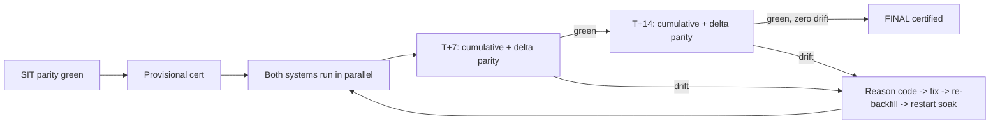
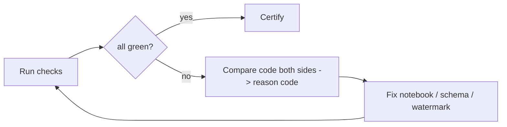

# 07 - Validation framework

MAYA proves every table against the source with strict, deterministic checks. This doc
covers the checks themselves; [08_maya_two_phase_validation.md](08_maya_two_phase_validation.md)
covers how they are split across the cheap dev phase and the full SIT phase. See
[core/validation.py](../core/validation.py).

## The ten checks
| # | Check | Definition |
|---|---|---|
| 1 | schema_parity | column names, order, types, nullability, precision |
| 2 | row_count | total + per-partition counts |
| 3 | key_parity | PK/business key set identical (no missing/extra/dupes) |
| 4 | content_checksum | order-independent per-row hash aggregated per table |
| 5 | column_aggregates | SUM/MIN/MAX/COUNT-distinct per column |
| 6 | null_distribution | per-column null + distinct counts |
| 7 | referential_integrity | FKs resolve to certified parents; no orphans |
| 8 | no_extra_output | only the contract's tables/columns exist |
| 9 | idempotency | re-run yields identical output (same hash) |
| 10 | row_level_sample | failing keys/columns enumerated old-vs-new |

## Point-in-time basis
SIT comparisons are pinned to a watermark (`watermark_col <= watermark_value`) so both
sides see the same rows - deterministic even while the source keeps loading.

## Sustained parity (MAYA-Soak) - proving the logic, not just the state
Point-in-time SIT parity proves **state equality** at one instant. It does **not** prove
that the *ongoing* incremental logic matches. A pipeline can match 100% at build time and
then slowly diverge over days: a subtle difference in MERGE/upsert, CDC ordering, SCD
effective-dating, or late-arriving-row handling accumulates silently across production
loads and only surfaces later.

So build-time parity earns only a **provisional** certification. Both systems then keep
running **in parallel**, and MAYA re-proves parity at each soak window - default **T+7**
and **T+14** days - before **final** certification. At each checkpoint we run the full
battery on:

1. the **cumulative** table (state still identical), and
2. the **incremental delta** loaded since the previous checkpoint
   (`prev_watermark < watermark_col <= now`).

The delta check is the important one: a broken incremental step can be masked on a full
recompute but never on the slice it actually produced. Any nonzero drift is a defect -
root-caused via the same loop, typically to reason code `INCREMENTAL-LOGIC` or
`LATE-DATA`, fixed, the window re-backfilled, and the soak clock restarted.

See `PROFILE_SOAK`, `soak_checkpoints()`, and `soak_delta_sql()` in
[core/validation.py](../core/validation.py); configure windows with
`maya.soak_windows_days` (see [08](08_maya_two_phase_validation.md)).

## The drift-investigation loop
On any mismatch, the agent inspects code on BOTH sides, assigns a reason code, fixes,
and re-runs. No mismatch is waived except a documented, signed-off LEGACY-BUG.

### Reason codes
`TRANSLATION`, `SCHEMA`, `TIMING`, `SOURCE-CHANGE`, `TYPE-NUANCE`, `LEGACY-BUG`, and the
soak-only codes `INCREMENTAL-LOGIC` (merge/CDC/SCD/upsert diverges over successive runs)
and `LATE-DATA` (late-arriving/out-of-order rows handled differently over time).

## No partial credit
A pipeline is **provisionally** certified only when every parity table passes every
required check for MAYA-Dev and MAYA-SIT, and **finally** certified only when every soak
window (T+7, T+14) is green with zero drift. 99% is red.
