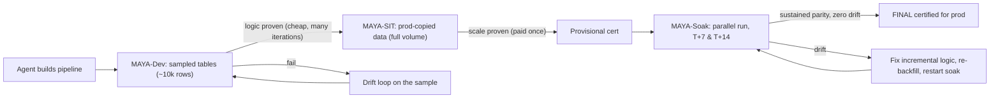

# 08 - MAYA two-phase validation (the technique)

MAYA exists because validation is the most expensive part of most migrations: teams
run full parity against production-scale data over and over while the logic is still
being fixed, paying prod-scale compute for every drift iteration. MAYA removes that
waste.

*Maya* means "illusion". The dev workspace holds a small illusion of production - every
customer table, but only a few thousand rows. You prove the logic is correct there
cheaply, and only then pay once to prove it at scale on production-copied data in SIT.

## The phases
| Phase | Env | Data | Checks | Cost | Cert |
|---|---|---|---|---|---|
| MAYA-Dev | dev | every table sampled (default 10k rows) | schema, key, referential integrity, no-extra-output, idempotency, row-level sample | tiny | - |
| MAYA-SIT | SIT | production-copied data (full volume) | all 10, at scale, point-in-time | paid once | provisional |
| MAYA-Soak | SIT (parallel run) | live production loads at T+7 & T+14 | all 10 on cumulative **and** the incremental delta window | tiny per checkpoint | final |

MAYA-Dev runs only the **volume-independent** checks - full-volume row counts,
checksums, and aggregates are meaningless on a sample, so they are deferred to SIT. See
`PROFILE_DEV_SAMPLE` / `PROFILE_SIT_FULL` / `PROFILE_SOAK` in
[core/validation.py](../core/validation.py).

## The third phase: MAYA-Soak (sustained parity)
Dev + SIT are the **cost** technique (prove logic cheaply, prove scale once). But scale
parity is *point-in-time*: it proves the tables are equal at one instant, not that the
**incremental logic** stays equal. A pipeline can match 100% at cutover and then drift
over a week when a subtle MERGE/CDC/SCD/late-data difference compounds across loads.

MAYA-Soak closes that gap. After SIT is green the pipeline is only **provisionally**
certified; both systems keep running in parallel and MAYA re-proves parity at each window
in `maya.soak_windows_days` (default `[7, 14]`). Each checkpoint checks the cumulative
table **and** the delta slice loaded since the previous checkpoint (`soak_delta_sql`) -
the delta is where creeping incremental bugs show up. Zero drift across all windows is
required for **final** certification; drift is root-caused (`INCREMENTAL-LOGIC` /
`LATE-DATA`), fixed, the window re-backfilled, and the soak clock restarted. Soak
checkpoints are cheap (a couple of scheduled parity runs), so this durability guarantee
adds calendar time, not meaningful compute.

## Building the illusion: RI-preserving sampling
A naive per-table sample breaks joins (a fact row's dimension key may be absent). MAYA's
sampler ([core/maya.py](../core/maya.py)) preserves referential integrity:

1. **Seed** each table with a deterministic sample (ordered by key hashed with a fixed
   seed, so it is reproducible - which keeps idempotency checks meaningful).
2. **Reference/dimension/config tables** are copied whole (small, and needed for joins).
3. **FK closure** - for every parent referenced by a sampled child, pull the referenced
   parent rows in, so every foreign key in the sample resolves.

Config it with [templates/maya_sample.example.yaml](../templates/maya_sample.example.yaml)
(row budget, overrides, reference tables, foreign keys). `cli.py maya sample` emits the
CTAS SQL and a `maya_sample_manifest` recording exactly what dev should contain.

## The certification gate
`validation.maya_gate()` returns:
- **BLOCKED** until the dev profile is fully green AND all ten SIT checks are green,
- **PROVISIONAL** once dev + sit are green (`require_both_phases`) but soak is still
  running,
- **CERTIFIED** only when, in addition, every scheduled soak window is fully green
  (`require_soak`). No prod promotion otherwise.

## The cost model
- Drift iterations (usually many per pipeline) run on a few thousand rows on serverless
  - effectively free.
- Full-volume compute is incurred only in MAYA-SIT, once, after the logic is already
  correct.
- Net effect: validation compute drops from "prod-scale x every iteration" to
  "prod-scale x once", typically an order-of-magnitude reduction, while parity remains
  provably 100%.

## When dev is already sampled
If the source team already lands sampled tables in dev, set `maya.sampling: none`; MAYA
skips building samples and just validates against them.
