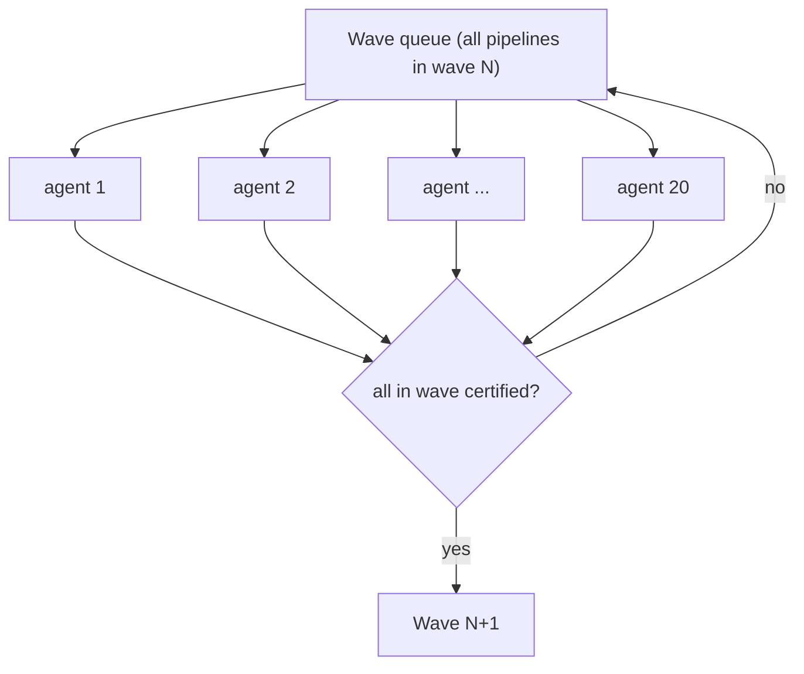

# 09 - Agent orchestration

MAYA is designed to run mostly autonomously: a pool of coding agents drains each wave in
parallel, self-validates through both MAYA phases, and only escalates to a human on the
rare unresolved parity issue. See [core/orchestration.py](../core/orchestration.py) and
[templates/agent_prompt.md](../templates/agent_prompt.md).

## The agent driver (offline | cursor)

MAYA prepares deterministic work (contracts, prompts, parity plans); a swarm behind an
`AgentDriver` does the three things MAYA cannot do deterministically -
`build(ctx)`, `fix(ctx, spec, parity_report, original_code)`, and `convert_bi(obj)`. See
[core/agents/](../core/agents). Two backends ship:

| Backend | When | How |
|---|---|---|
| `OfflineAgentDriver` | demo / CI (default) | authors specs deterministically from the source logic + Stage-1 context pack; no LLM, no network |
| `CursorAgentDriver` | real migrations | drives local LLM coding agents via the Cursor SDK (`cursor_sdk` + `CURSOR_API_KEY`), which write `authored/<pipeline>.json` in the repo |

Select with `agents.driver` in the project YAML. `agents.concurrency` bounds intra-wave
parallelism; `agents.max_fix_iters` bounds the drift loop.

## The swarm across the two build phases (stages 4, 6, 7)

Build + certify runs in **two phases with the same authored code**. The dev phase (stage 4)
builds and certifies on the ~10k sample; the prod phase re-certifies the identical code on
the full data after a full load (stage 6), at stage 7.

`orchestration.build_swarm(cfg)` (Stage 4b, **dev**) executes wave by wave with intra-wave
parallelism (a bounded `ThreadPoolExecutor`). Per pipeline it: `driver.build` -> write
`authored/<pipeline>.json` -> validate the spec -> run **MAYA-Dev** parity on the Stage-2
synthetic dev catalog -> on red, `driver.fix` compares the authored code against the
original source and retries until green or `max_fix_iters`. The next wave starts only
after the current wave is authored + dev-green. Stage 4c then dev-certifies the sample.

Stage 6 performs the **full load + historical** backfill of the source estate, so the same
pipelines can be re-proven at full volume.

`orchestration.certify_swarm(cfg)` (Stage 7, **prod**) certifies **in topological order**: a
pipeline may certify only after all its predecessors are CERTIFIED (independent pipelines
proceed in parallel). Each runs **MAYA-SIT** (all ten checks) on the full/historical data
with the same fix-vs-original loop, then soak windows drive final certification. Because
both phases load the same `authored/<pipeline>.json`, any prod repair is persisted back to
that single source of truth so dev and prod never diverge. Results are written to
`out/gates.json` as `{pipeline -> maya_gate() result}`.

BI mirrors this split: stage 5 converts + dev-certifies the queries on the sample gold, and
stage 8 parity-checks + republishes the SAME queries on the full gold.

```bash
maya build   --config project.yaml                 # Stage 4: conformance -> build (dev) -> dev-certify
maya run --stage 6 --config project.yaml           # Stage 6: full load + historical (prod)
maya run --stage 7 --config project.yaml           # Stage 7: certify the SAME code on full data
maya certify --config project.yaml --gates out/gates.json   # roll gates into system state
```

## Pooled work-queue within a wave
Within a wave, pipelines are independent, so a pool of 15-20 agents draws from a common
queue. Pod size is a dynamic split of the pool that responds to wave width.



## Strict wave barrier
The next wave depends on this wave's data, so a wave advances only when **every**
pipeline in it is at least **provisionally** MAYA-certified (dev AND SIT). No early
starts. The sustained soak (below) then runs in parallel and does not hold the barrier.

## The agent lifecycle (per pipeline)
1. Read the contract (context pack). Fail fast if G0 is not green.
2. Author bronze/silver/gold (SQL-first) - translate real source logic, never invent.
3. **MAYA-Dev**: run on the sampled tables; drift-loop until the dev profile is green.
4. **MAYA-SIT**: run at scale on prod-copied data; drift-loop until all 10 are green
   (dev + SIT green = provisional certification; the agent is freed to the next pipeline).
5. **MAYA-Soak**: on schedule, re-prove parity at T+7 and T+14 while the source still
   runs in parallel (cumulative + incremental delta); zero drift = final certification.
   Any drift (INCREMENTAL-LOGIC / LATE-DATA) reopens the drift loop and restarts the soak.
6. Emit `authored/<pipeline>.json`; record gates + parity to the control tables.

## Resumability + status
A pipeline is "done" iff a VALID `authored/<pipeline>.json` exists, so batches resume
naturally. `orchestration.status()` reports done/pending by wave and kind;
`pending()` yields the next work items; `validate()` checks authored specs against the
required schema per kind. Drive it from the CLI:

```bash
maya orchestrate --status   --config project.yaml   # done/pending by wave
maya orchestrate --pending  --config project.yaml --wave 1   # next work items
maya orchestrate --prompt   nw_build_sales --config project.yaml   # agent prompt
maya orchestrate --validate all --config project.yaml   # check authored specs
```

## System rollup: "is the migration complete?"
`maya_gate()` certifies **one** pipeline (BLOCKED -> PROVISIONAL -> CERTIFIED). But a
migration is only finished when the **whole estate** is. `validation.system_certification()`
aggregates every per-pipeline gate (and every dependent BI object) across all waves into a
single verdict, surfaced by `maya certify`:

| System state | Meaning |
|---|---|
| `MIGRATION_IN_PROGRESS` | at least one pipeline is BLOCKED - the estate is still being built |
| `SYSTEM_PROVISIONAL` | every pipeline is at least PROVISIONAL (logic + scale parity green), but some are still soaking or BI is pending - functionally live, not yet durable |
| `MIGRATION_COMPLETE` | every pipeline is CERTIFIED (dev + sit + soak, zero drift) AND all BI is migrated - the source can be retired |

```bash
maya certify --config project.yaml                 # build-progress rollup (per wave)
maya certify --config project.yaml --gates gates.json   # live status from real parity results
```

`--gates` takes a JSON map of `pipeline -> maya_gate() result` (or a plain
`pipeline -> "CERTIFIED"|"PROVISIONAL"|"BLOCKED"` shorthand). Only `MIGRATION_COMPLETE`
marks the migration done.

## What stays human
Setup (Phase 0) and watching the dashboard. Manual review is triggered only when a
pipeline cannot reach parity after the drift loop exhausts - expected to be rare.
