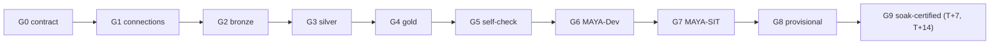
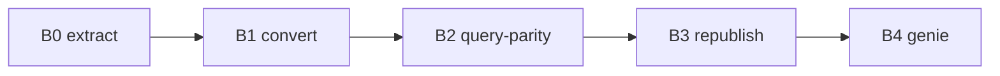
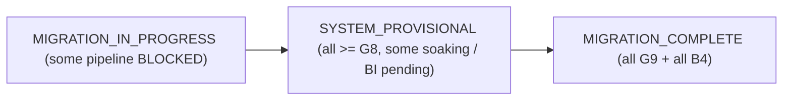

# 10 - Execution plan and gates

Each pipeline crosses a fixed sequence of gates. A pipeline is a build unit; a wave is a
barrier. MAYA adds the validation gates (G6-G9): G6/G7 make build-time certification
cheap, and G9 (soak) makes it durable.

## Stage gates (the six-stage flow)

Above the per-pipeline gates below, MAYA runs six **stage** gates end to end. Each writes
a gate JSON under `out/`; the orchestrator (`core/stages.py`, `maya run`) refuses to
advance past a failed one and records progress in `out/stage_state.json`.

| Stage gate | Passes when | Artifact |
|---|---|---|
| 1 collect + score | every pipeline 100% traversable, all tables/views identified, all externals tagged, order verifies | `stage1_gate.json`, `discovery_score.csv` |
| 2 replicate | every table AND view present in `maya.test_catalog` (RI-preserving fill) | `stage2_gate.json`, `stage2_replicate.sql` |
| 3 specs | one spec PDF per pipeline | `stage3_gate.json`, `specs_pdf/` |
| 4a conformance | order+waves valid AND every spec PDF conforms to its wave | `stage4_conformance.json` |
| 4b build | every pipeline authored + MAYA-Dev green on synthetic dev | `stage4_build.json` |
| 4c certify | every pipeline CERTIFIED in topological order | `gates.json`, `stage4_certify.json` |
| 5 BI | every BI object DONE (convert + parity + republish + Genie) | `stage5_bi_gate.json` |
| 6 docs + publish | docs generated for every object + committed | `stage6_docs.json`, `stage6_publish.json` |

The per-pipeline gates (G0-G9) and BI gates (B0-B4) below are what a single build unit
crosses **inside** stages 4 and 5.

## Gates
| Gate | Name | Passes when |
|---|---|---|
| G0 | contract | needs/logic/output 100% resolved (see [05](05_pipeline_contract.md)) |
| G1 | connections | all required connections smoke-test green (see [11](11_dashboard.md)) |
| G2 | bronze | prerequisites landed (dev sample + SIT prod copy present) |
| G3 | silver | typed hubs + intermediates built |
| G4 | gold | parity tables built with source-identical schema |
| G5 | self-check | no-extra-output + idempotency locally |
| G6 | maya_dev | dev profile green on the sampled illusion of prod |
| G7 | maya_sit | all 10 checks green at scale on prod-copied data, point-in-time |
| G8 | provisional | G6 AND G7 green; provisionally certified, soak clock starts |
| G9 | soak_certified | sustained parity green at every window (T+7, T+14), zero drift -> FINAL cert |

G0-G8 are reached in the build sprint. G9 is reached later, on the calendar: the pipeline
runs in parallel with the source for one to two weeks and re-proves parity. The build
queue does **not** wait on soak - agents move on to the next pipeline while provisional
pipelines soak in the background; only the final sign-off waits for G9.

## Timelines
- **1-2 weeks (autonomous, monitored)** - the standard MAYA run: 15-20 agents, waves in
  parallel, two-phase validation, human watches the dashboard.
- **Under one week (24/7, serverless)** - when Phase 0 is fully pre-completed
  (connections proven, dev sample + SIT prod copy in place, serverless on, dashboard
  live). MAYA-Dev iterations are near-free on serverless; MAYA-SIT is the only
  full-volume cost and runs once per certified pipeline.

The compression comes from MAYA: because logic is proven on the sample, SIT runs are
first-time-right far more often, so the paid full-volume pass rarely repeats.

## Backfill
After SIT parity is green, backfill history at the pinned watermark, then re-run G7 on
the backfilled range before G8 (provisional).

## Soak (G9) - sustained parity while running in parallel
Build-time parity proves state equality once; it cannot prove the incremental logic
matches. So after G8 the new pipeline runs **in parallel** with the source and MAYA
re-proves parity at each window in `maya.soak_windows_days` (default T+7, T+14), on the
cumulative table **and** the incremental delta since the prior checkpoint. Zero drift at
every window = G9 = final certification. Any drift (`INCREMENTAL-LOGIC` / `LATE-DATA`) is
fixed, the window re-backfilled, and the soak clock restarted. Watch it via
`v_soak_watch` (see [11](11_dashboard.md)). Because the timeline sections below cover the
build sprint, plan for final certification to land ~2 weeks after a pipeline's build,
overlapped across all pipelines rather than added per pipeline.

## BI gates (after gold is certified)
Once the gold tables a dashboard reads are MAYA-certified, its BI object flows through:

| Gate | Name | Passes when |
|---|---|---|
| B0 | extract | query + datasource + tables pulled via MCP/API |
| B1 | convert | AI-converted to Databricks SQL, tables repointed to certified gold |
| B2 | query-parity | converted query returns the exact same result as the original |
| B3 | republish | dashboard republished to the BI tool, now on Databricks |
| B4 | genie | Lakeview dashboard + Genie space created (AI/BI) |

See [13_bi_layer_migration.md](13_bi_layer_migration.md).

## System gate (S) - migration complete
The per-pipeline gates above certify one build unit; the **system gate** certifies the
whole estate. It is the only gate that answers "is the migration done?"

| Gate | Name | Passes when |
|---|---|---|
| S | migration_complete | **every** in-scope pipeline is at G9 (FINAL cert) **and** every BI object is at B4 |

`maya certify` rolls all per-pipeline gates (and BI) across all waves into one state:

Only `MIGRATION_COMPLETE` clears the source systems for retirement. Run it with
`maya certify --config project.yaml` (add `--gates <json>` of real parity results for live
status). See [09_agent_orchestration.md](09_agent_orchestration.md).
