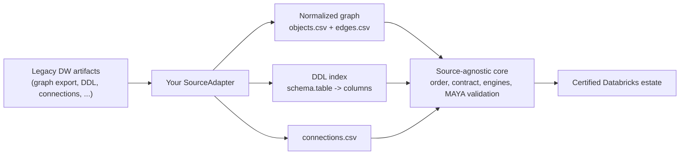

# 12 - Adapter authoring guide: onboard a new data warehouse

Onboarding a new source system (Snowflake, Redshift, Teradata, Oracle, SQL Server,
Netezza, BigQuery, Hadoop/Hive, Informatica, SSIS, dbt, ...) means writing **one class**:
a `SourceAdapter`. Everything else - build order, the pipeline contract, the reusable
engines, MAYA two-phase validation, agent orchestration, and the reports - is reused
**unchanged**. If your adapter can emit the normalized graph, the whole accelerator runs.

Two reference adapters ship today:

- [adapters/synapse/adapter.py](../adapters/synapse/adapter.py) - Azure Synapse; runs the
  bundled Northwind demo (`examples/northwind/`).
- [adapters/postgres/adapter.py](../adapters/postgres/adapter.py) - PostgreSQL; migrates
  the bundled retail estate (`examples/retail/`). It subclasses `SynapseAdapter` and
  overrides only two methods - proof of how little a new source needs.

The contract lives in [adapters/base.py](../adapters/base.py).

---

## 1. What an adapter is (and is not)

An adapter is the **only source-specific code** in a migration. Its job is to turn a
legacy platform's **exported artifacts** into the normalized dependency graph plus a DDL
index, a connection inventory, and a best-effort SQL dialect translator.

An adapter is **not** a live database driver. There is no `connect()`, `list_tables()`,
`sample_rows()`, or `checksum()` on the contract. Sampling, row counts, checksums, and
parity live in the source-agnostic core (`core/maya.py`, `core/validation.py`); they
operate on the graph + DDL your adapter produces. This is what makes MAYA runnable
end-to-end offline from exported artifacts.



---

## 2. The contract: five required methods

Subclass `SourceAdapter` and implement these five abstract methods
([adapters/base.py](../adapters/base.py) lines 29-52):

| # | Method | Signature | Returns | Responsibility |
|---|--------|-----------|---------|----------------|
| 1 | `collect` | `collect(self) -> str` | artifacts dir | Gather/refresh raw source artifacts under `cfg.artifacts_dir`; return the directory. |
| 2 | `parse` | `parse(self) -> Graph` | `Graph` | Parse artifacts into the normalized `Graph` and persist `objects.csv` / `edges.csv`. |
| 3 | `ddl_index` | `ddl_index(self) -> Dict[str, List[str]]` | `{ "schema.table": [cols] }` | Ordered column list per fully-qualified table/view, from source DDL. |
| 4 | `connections` | `connections(self) -> List[dict]` | rows | Connection/linked-service inventory (also written to `connections.csv`). |
| 5 | `dialect_translate` | `dialect_translate(self, sql: str) -> str` | Spark SQL | Best-effort source SQL -> Spark SQL (assistive; agents still verify). |

`SourceAdapter.__init__` stores `self.cfg` (the `AcceleratorConfig`) and
`self.opts` (`cfg.adapter_options`, a free-form dict). The convenience method
`build_graph()` runs `collect()` -> `parse()` -> `save()` and is what stages and the CLI
call.

---

## 3. The one hard requirement: emit the normalized graph

`parse()` must produce `objects.csv` and `edges.csv` with the **exact columns and edge
vocabulary** defined in [core/graph.py](../core/graph.py) (see also
[03_graph_and_lineage.md](03_graph_and_lineage.md)):

```
objects.csv columns:
  object_key, name, type, layer, schema_or_domain, title, source_file,
  active, target_database, job_class, external_system

edges.csv columns:
  src_key, src_name, src_type, edge_type, dst_key, dst_name, dst_type,
  exec_order, predecessors, when_condition, context
```

Canonical `edge_type` vocabulary:

`READS_TABLE`, `WRITES_TABLE`, `CALLS_PROC`, `EXECUTES_PIPELINE`, `READS_CONFIG`,
`MAPS_TO_SOURCE` (legacy synonym `MAPS_TO_SYNAPSE`), `INVOKES_EXTERNAL`.

Object `type` values are driven by your project config: `pipeline_types`
(default `[PIPELINE, SYNAPSE_PIPELINE]`) and `table_types`
(default `[TABLE, CONFIG_TABLE]`), plus `VIEW`.

If you can produce these two CSVs correctly, the entire accelerator works. The Northwind
example (`examples/northwind/objects.csv`, `edges.csv`) is a good template to copy.

### DDL layout

`ddl_index()` reads one `.sql` file per object under:

```
artifacts/DW/<database>/<schema>/Tables/<name>.sql
artifacts/DW/<database>/<schema>/Views/<name>.sql
```

and returns `{ "schema.name": ["col1", "col2", ...] }` (lowercased keys). Accurate DDL is
what gives parity its column lists and lets the sampler copy full schema, so invest here.

---

## 4. Optional hooks (safe defaults provided)

These ship with non-empty defaults derived from the graph/DDL/connections, so a minimal
adapter still gets baseline Stage 0/1 coverage. Override them to export the real thing
from your platform.

**Stage-1 asset exports** ([base.py](../adapters/base.py) lines 59-100):

| Method | Returns | Default |
|--------|---------|---------|
| `export_schedules()` | `[{trigger, schedule, pipeline, enabled}]` | one trigger per pipeline from `job_class` |
| `export_configs()` | `{table: [rows]}` | one header row per `CONFIG_TABLE` from DDL |

**Stage-0 identity / security / governance** ([base.py](../adapters/base.py) lines 102-213):

| Method | Returns | Default |
|--------|---------|---------|
| `export_principals()` | `[{principal, type, member_of, source_role, description}]` | synthetic role model from `home_database` |
| `export_grants()` | `[{principal, object, privilege}]` | least-privilege model over home schemas |
| `export_secrets()` | `[{secret, connection, type, notes}]` | one secret per connection |
| `classify_data()` | `[{table, column, classification, mask}]` | PII detection via `PII_PATTERNS` over `ddl_index()` |
| `export_security_facts()` | `dict` | platform-managed encryption/audit defaults |

The reference `SynapseAdapter` overrides all of these to read real exports from
`<source_dir>/schedules.csv`, `<source_dir>/configs/*.csv`, and
`artifacts/security/*` when present, and falls back to `super()` otherwise - a good
pattern to copy.

**Knowledge-base manifest** ([base.py](../adapters/base.py) lines 219-292): the classmethod
`kb_manifest()` declares which asset kinds your source can supply, so the web app can
render an export checklist, route uploads, and compute coverage. Override it to give
source-specific export instructions (see how Synapse/Postgres tailor the `instructions`).
See [17_knowledge_base_assets.md](17_knowledge_base_assets.md) for the full asset model.

---

## 5. Which stage calls which method

| Stage | Module | Adapter methods used |
|-------|--------|----------------------|
| 0 Readiness | `core/readiness.py` | `build_graph` (if graph missing), `export_principals/grants/secrets`, `classify_data`, `export_security_facts`, `connections` |
| 1 Collect + Score | `core/stages.py`, `core/score.py` | `build_graph`, `ddl_index`, `export_schedules`, `export_configs` |
| 2 Replicate (dev) | `core/replicate.py` | `dialect_translate` (view definitions) |
| 5 / 8 BI | `core/bi.py` | `dialect_translate` (BI query SQL); BI uses a separate `BIConnector` |
| 9 Docs | `core/docs.py` | `ddl_index` |
| 10 Identity | `core/identity.py` | `connections` + Stage-0 exports from disk |

CLI entry points: `cli.py graph` -> `build_graph`; `cli.py context` -> `ddl_index` +
contract generation.

---

## 6. Minimal worked skeleton (fast-path)

Start with the fast-path pattern: if a prior discovery/introspection step already produced
`objects.csv` / `edges.csv`, load them in `parse()` to get running immediately, then
replace with a real parser later.

```python
from __future__ import annotations
import csv, os, re, shutil
from typing import Dict, List

from core.graph import Graph
from adapters.base import SourceAdapter


class SnowflakeAdapter(SourceAdapter):
    name = "snowflake"

    def _source_dir(self) -> str:
        return self.opts.get("source_dir", self.cfg.p(self.cfg.graph_dir))

    def _artifacts_dir(self) -> str:
        return self.opts.get("artifacts_dir", self.cfg.p(self.cfg.artifacts_dir))

    # 1. collect: bring pre-exported graph CSVs into the workspace
    def collect(self) -> str:
        src = self._source_dir()
        os.makedirs(os.path.dirname(self.cfg.objects_csv()), exist_ok=True)
        for name, dst in (("objects.csv", self.cfg.objects_csv()),
                          ("edges.csv", self.cfg.edges_csv())):
            s = os.path.join(src, name)
            if os.path.exists(s) and os.path.abspath(s) != os.path.abspath(dst):
                shutil.copyfile(s, dst)
        return self._artifacts_dir()

    # 2. parse: load the normalized graph
    def parse(self) -> Graph:
        obj, edge = self.cfg.objects_csv(), self.cfg.edges_csv()
        if not (os.path.exists(obj) and os.path.exists(edge)):
            self.collect()
        if not (os.path.exists(obj) and os.path.exists(edge)):
            raise FileNotFoundError(
                "No objects.csv/edges.csv found. Set adapter_options.source_dir to a "
                "Snowflake discovery directory, or plug in a full parser.")
        return Graph.load(obj, edge, self.cfg.pipeline_types, self.cfg.table_types)

    # 3. ddl_index: walk artifacts/DW/<db>/<schema>/{Tables,Views}/*.sql
    def ddl_index(self) -> Dict[str, List[str]]:
        # Reuse the Synapse DDL walker, or export Snowflake INFORMATION_SCHEMA.COLUMNS
        # into the same layout. Return {"schema.table": ["col1", "col2", ...]}.
        return {}

    # 4. connections: read the exported inventory
    def connections(self) -> List[dict]:
        path = os.path.join(self._source_dir(), "connections.csv")
        if not os.path.exists(path):
            return []
        with open(path, newline="") as f:
            return list(csv.DictReader(f))

    # 5. dialect_translate: Snowflake SQL -> Spark SQL (assistive)
    def dialect_translate(self, sql: str) -> str:
        s = sql
        s = re.sub(r"\bNVL\s*\(", "coalesce(", s, flags=re.I)
        s = re.sub(r"\bCURRENT_TIMESTAMP\s*\(\s*\)", "current_timestamp()", s, flags=re.I)
        s = re.sub(r"::\s*([A-Za-z0-9_]+)", r"", s)          # drop ::casts (verify)
        s = re.sub(r"\bIFF\s*\(", "if(", s, flags=re.I)
        return s

    @classmethod
    def kb_manifest(cls) -> List[dict]:
        m = SourceAdapter.kb_manifest()
        how = {
            "graph": "From Snowflake: export the pipeline/table dependency graph as "
                     "objects.csv/edges.csv (or upload tasks/streams/views SQL for MAYA "
                     "to parse).",
            "ddl": "GET_DDL('table', ...) per object into "
                   "artifacts/DW/<db>/<schema>/{Tables,Views}/<name>.sql.",
            "connections": "Export SHOW INTEGRATIONS / stages as connections.csv.",
        }
        for e in m:
            if e["kind"] in how:
                e["instructions"] = how[e["kind"]]
        return m
```

### Even less code: subclass an existing fast-path

If your warehouse can produce the same CSV + DDL layout as the reference adapters, do what
`PostgresAdapter` does - subclass `SynapseAdapter` and override only the genuinely
source-specific pieces:

```python
from adapters.synapse.adapter import SynapseAdapter

class MyDWAdapter(SynapseAdapter):
    name = "mydw"
    def dialect_translate(self, sql: str) -> str: ...   # your dialect
    @classmethod
    def kb_manifest(cls): ...                            # your export instructions
```

---

## 7. Register the adapter

**CLI / local project** - point `adapter:` at your dotted class path in the project YAML
(`AcceleratorConfig.load_adapter()` imports it). See
[templates/project_config.example.yaml](../templates/project_config.example.yaml):

```yaml
adapter: adapters.snowflake.adapter.SnowflakeAdapter
home_database: my_dw
pipeline_types: [PIPELINE]
table_types: [TABLE, CONFIG_TABLE]
schema_layers: { src: bronze, stg: silver, gold: gold, serving: serving }
adapter_options:
  source_dir: path/to/discovery          # objects.csv / edges.csv / connections.csv
  artifacts_dir: path/to/artifacts       # DW/ DDL tree + security/ exports
```

**Web app** - add your source system to the `ADAPTERS` map in
[server/workspace.py](../server/workspace.py) so intake can select it:

```python
ADAPTERS = {
    "synapse": "adapters.synapse.adapter.SynapseAdapter",
    "postgres": "adapters.postgres.adapter.PostgresAdapter",
    "postgresql": "adapters.postgres.adapter.PostgresAdapter",
    "snowflake": "adapters.snowflake.adapter.SnowflakeAdapter",   # <- add
}
```

Until a dedicated adapter is registered, unknown source systems fall back to the Synapse
fast-path (`DEFAULT_ADAPTER`), which works as long as you supply the normalized graph +
DDL in the expected layout.

---

## 8. Validate and ship

Run the early phases against a project config that points at your adapter:

```bash
python3 cli.py graph   --config myproject.yaml   # build_graph -> objects/edges
python3 cli.py order   --config myproject.yaml   # topological build order + verifier
python3 cli.py context --config myproject.yaml   # ddl_index -> pipeline contracts
python3 cli.py run --stage 0 --config myproject.yaml   # readiness (identity/security)
python3 cli.py run --stage 1 --config myproject.yaml   # collect + score (must hit 100%)
```

Stage 1 scoring requires every pipeline to be fully traversable (all table references
resolved or marked external). A DDL-only estate (tables/views but no pipeline lineage)
cannot pass Stage 1 - the graph export is authoritative for lineage.

**Ship a synthetic demo estate** (see [CONTRIBUTING.md](../CONTRIBUTING.md)): a small,
license-clean example with `objects.csv`, `edges.csv`, `connections.csv`, a DDL tree, and
optional security exports, plus a `<name>.yaml` project config - so CI can run your adapter
end-to-end offline (mirrors `examples/northwind/` and `examples/retail/`). Add tests under
[tests/](../tests) following `tests/test_stages.py` and `tests/test_agents.py`.

---

## 9. Author checklist

- [ ] `adapters/<source>/adapter.py` with a `SourceAdapter` (or `SynapseAdapter`) subclass and a unique `name`.
- [ ] `collect()` gathers artifacts; `parse()` emits `objects.csv` + `edges.csv` with the exact columns + edge vocabulary.
- [ ] `ddl_index()` returns `{schema.table: [cols]}` from a `artifacts/DW/<db>/<schema>/{Tables,Views}/*.sql` tree.
- [ ] `connections()` returns the connection inventory.
- [ ] `dialect_translate()` handles your dialect's common constructs.
- [ ] (Recommended) override `export_schedules/configs`, the Stage-0 security exports, and `kb_manifest()` for real exports + source-specific instructions.
- [ ] Register: `adapter:` in the project YAML and (for the web app) the `ADAPTERS` map.
- [ ] `cli.py graph|order|context` and `run --stage 0/1` pass on a synthetic demo estate.
- [ ] A small example estate + tests committed so CI runs offline.

---

## Related docs

- [03_graph_and_lineage.md](03_graph_and_lineage.md) - the normalized graph contract in detail.
- [17_knowledge_base_assets.md](17_knowledge_base_assets.md) - what assets to export per source, and best practices.
- [tutorial/02_the_adapter_model.md](tutorial/02_the_adapter_model.md) - the adapter model, walked through on Northwind.
- [13_bi_layer_migration.md](13_bi_layer_migration.md) - the separate `BIConnector` contract for BI tools.
