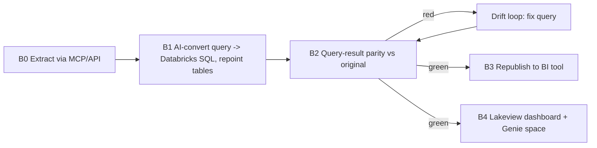

# 13 - BI layer migration (dashboards + AI/BI)

MAYA migrates the BI layer, not just the data. Enterprise migrations move dashboards from
Looker / Tableau / Power BI to Databricks; MAYA agents do it end to end over MCP/API, with
the same "exact same result" rigor used for table parity. See
[core/bi.py](../core/bi.py), the connectors under [adapters/bi/](../adapters/bi), and
[templates/bi_config.example.yaml](../templates/bi_config.example.yaml).



## Why it is agent-driven over MCP/API
Every step is performed by agents. Connectors reach the BI tool through its MCP server (or
REST/XMLA API): export the package, extract each query-bearing object, and later republish.
AI does the query conversion; the parity harness proves it; Genie/Lakeview specs are
generated from the same objects. The only BI-tool-specific code is the connector.

## Query-result parity (exact same result)
The agent runs the ORIGINAL query on the source and snapshots its result; the CONVERTED
query runs live against certified Databricks gold. The results must be identical:

| Check | Proves |
|---|---|
| result_schema | column names/order/types match |
| result_rowcount | same number of rows |
| result_set_equality | `EXCEPT` both ways is empty (unordered set identical) |
| result_checksum | order-independent aggregate row hash matches |
| result_order | if the original is ordered, row order matches |

On any mismatch the agent inspects both queries, assigns a reason code (shared with the
data drift loop: TRANSLATION / SCHEMA / TYPE-NUANCE / TIMING / SOURCE-CHANGE / LEGACY-BUG),
fixes the converted query, and re-runs until green. No partial credit.

## Republish
Proven dashboards are published back to the BI tool via API, now pointed at Databricks
(Looker connection / Tableau datasource swap / Power BI dataset rebind).

## AI to BI: Genie + Lakeview replicas
In parallel, MAYA replicates each dashboard natively in Databricks as a Lakeview dashboard
and attaches a **Genie space** seeded by that dashboard's own queries: tile titles become
curated sample questions and the converted queries become trusted assets. Business users
get natural-language AI/BI on the exact certified numbers.

## Gates B0-B4
| Gate | Passes when |
|---|---|
| B0 extract | object's query + datasource + tables pulled |
| B1 convert | query converted + tables repointed to certified gold |
| B2 query-parity | all result-parity checks green |
| B3 republish | dashboard republished to the BI tool |
| B4 genie | Lakeview dashboard + Genie space created |

A BI object is DONE only at B4, and may only start after the gold tables it reads are
MAYA-certified ([10_execution_plan.md](10_execution_plan.md)).

## MAYA sampling note
Query-result parity is a result-set comparison, not a full-table scan, so it is cheap even
at SIT. Dev iterations of query conversion can run against the sampled illusion of prod for
a fast logic check before the SIT result-parity run.

## CLI
```bash
python3 cli.py bi extract --config project.yaml   # MCP/API (or offline package_dir)
python3 cli.py bi parity  --config project.yaml   # emit result-parity SQL per object
python3 cli.py bi genie   --config project.yaml   # emit Genie space + Lakeview specs
python3 cli.py bi status  --config project.yaml
```
Progress is tracked in `bi_object_status` / `bi_parity_results` with the `v_bi_progress`
view ([11_dashboard.md](11_dashboard.md)).
