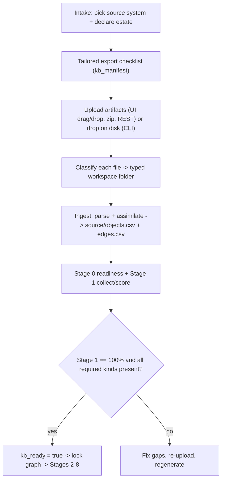

# 17 - Knowledge base assets: what to export, by source system, and best practices

Every MAYA migration starts by building a **knowledge base (KB)**: the exported artifacts
that describe your legacy estate - the dependency graph, DDL, connections, schedules,
config tables, security, BI packages, and any downstream apps. MAYA assimilates these into
a normalized graph, scores it, and only then unlocks the migration. This guide documents
every asset kind, the on-disk layout, the three ways to load assets (web UI, REST, CLI),
what to export per source system, and best practices.

The KB asset kinds are declared by each adapter's `kb_manifest()`
([adapters/base.py](../adapters/base.py)); how to author an adapter is covered in
[12_adapter_authoring_guide.md](12_adapter_authoring_guide.md).

---

## 1. The KB lifecycle



- **Web app**: uploads set `graph_stale=true` (and `kb_ready=false` for estate uploads);
  ingest re-runs assimilation + Stage 0/1 and sets `kb_ready=true` when the graph scores
  100% and all **required** manifest kinds are present. You then **lock** the graph to
  freeze Stages 2-8.
- **OSS/CLI**: there is no upload server; you place the same files on disk and point the
  project YAML at them (see section 5).

---

## 2. Workspace layout

Assets live in a per-project workspace with a fixed structure
([maya-webapp/server/workspace.py](../../maya-webapp/server/workspace.py)); the OSS
examples (`examples/northwind/`, `examples/retail/`) use the same conventions:

```
<project>/
  project.yaml
  uploads/            raw files parked here when unrecognized (nothing is lost)
  source/             objects.csv, edges.csv, connections.csv, schedules.csv, pipelines.json
  source/configs/     control/config table CSVs
  artifacts/DW/       DDL: <db>/<schema>/{Tables,Views}/<name>.sql
  artifacts/security/ principals.csv, grants.csv, secrets.csv, classification.csv, security_facts.json
  bi_export/          BI package: bi_queries.json / *.pbix / *.twb(x) / *.lookml
  app/<app_key>/      downstream apps: model/ etl/ api/ backend/ ui/ screens/
  out/                derived CSV/PDF/JSON that MAYA writes
```

---

## 3. Asset kinds

Files are classified by name/path into a **kind** and routed to a destination. Uploading a
`.zip` expands it member-by-member and classifies each file.

| Kind | Required | Destination | Format / what to export |
|------|----------|-------------|--------------------------|
| `graph` | **Yes** | `source/objects.csv`, `source/edges.csv` | The normalized dependency graph (authoritative for lineage). Columns below. |
| `ddl` | **Yes** | `artifacts/DW/<db>/<schema>/{Tables,Views}/<name>.sql` | `CREATE TABLE` / `CREATE VIEW` per object. |
| `connections` | No | `source/connections.csv` | Connection/linked-service inventory. |
| `schedules` | No | `source/schedules.csv` | Scheduler triggers that invoke pipelines. |
| `configs` | No | `source/configs/*.csv` | Control/watermark/mapping tables dumped as CSV. |
| `security` | No | `artifacts/security/*` | principals, grants, secret *names*, classification, facts. |
| `bi` | No | `bi_export/*` | BI package/queries for dashboards on this estate. |
| `pipelines` | No | `source/pipelines.json` | Converted gold transformations for live parity (not graph ingest). |
| `app_model` | If apps declared | `app/<key>/model/` | `app.json` manifest and/or OLTP DDL/JSON schema. |
| `app_etl` | No | `app/<key>/etl/` | ETL/SQL that populates the app datamodel from the DW. |
| `app_api` | No | `app/<key>/api/` | OpenAPI / Swagger / Postman contract. |
| `app_backend` | No | `app/<key>/backend/` | Backend source (reference for regeneration). |
| `app_ui` | No | `app/<key>/ui/` | UI source (reference for regeneration). |
| `app_screens` | No | `app/<key>/screens/` | Golden screenshots for UI/functional parity. |
| `other` | - | `uploads/` | Unrecognized; preserved but not parsed. |

### File-format specs

**`objects.csv`** columns ([core/graph.py](../core/graph.py)):

```
object_key, name, type, layer, schema_or_domain, title, source_file,
active, target_database, job_class, external_system
```

**`edges.csv`** columns:

```
src_key, src_name, src_type, edge_type, dst_key, dst_name, dst_type,
exec_order, predecessors, when_condition, context
```

Canonical `edge_type` values: `READS_TABLE`, `WRITES_TABLE`, `CALLS_PROC`,
`EXECUTES_PIPELINE`, `READS_CONFIG`, `MAPS_TO_SOURCE`, `INVOKES_EXTERNAL`. Object `type`
values are set by the project config `pipeline_types` / `table_types` (plus `VIEW`).

**`connections.csv`** header (from `examples/northwind/connections.csv`):

```
connection,type,external_system,host,n_pipelines,notes
```

**`schedules.csv`**: `trigger,schedule,pipeline,enabled`.

**`artifacts/security/`**: `principals.csv` (`principal,type,member_of,source_role,description`),
`grants.csv` (`principal,object,privilege`), `secrets.csv` (`secret,connection,type,notes`
- names only, never values), `classification.csv` (`table,column,classification,mask`),
`security_facts.json` (encryption/audit/compliance facts).

**`pipelines.json`** (optional, for live certification): one entry per graph pipeline whose
`name` matches the pipeline `object_key`, with `target`, `wave`, `databricks_sql`, and
`source_metrics_sql` (see `examples/retail/pipelines.json`).

**`app.json`** (per downstream app): entities, endpoints, screens, and ETL bindings; MAYA
turns it into a Lakebase schema + Databricks App. See
[maya-webapp/docs/knowledge_base_assets.md](../../maya-webapp/docs/knowledge_base_assets.md)
for the app-registration UI flow.

---

## 4. How assets are assimilated

On ingest, MAYA parses each asset and merges the fragments into
`source/objects.csv` + `source/edges.csv`:

- **Precedence**: an uploaded `graph` export is authoritative. DDL/SQL parsing **enriches**
  it (adds objects the export missed) and only **fully derives** the graph when no export
  was provided.
- **DDL** files parse columns and view `FROM`/`JOIN` lineage; unknown `.sql` gets generic
  lineage (`FROM`/`JOIN` -> reads; `INSERT`/`MERGE`/`CREATE` -> produces).
- **`connections` / `schedules` / `configs` / `security`** are counted at ingest and
  consumed by the adapter's Stage 0/1 exports.
- **`app_model`** expands into an APP subgraph (`APP`, `APP_ENTITY`, `APP_ENDPOINT`,
  `APP_SCREEN`) with edges to the DW tables it maps to.

Stage 1 then requires the graph to be **100% traversable** (every pipeline's table
references resolved or marked external). A DDL-only estate (tables/views but no pipeline
lineage) will not pass - which is why the `graph` export is required.

---

## 5. Three ways to load assets

### A. Web UI

On a project's Knowledge Base panel: review the tailored export checklist and coverage,
then drag/drop files or a `.zip` (objects/edges CSV, DDL `.sql`, connections, schedules,
security, BI package). Click **Regenerate graph** to ingest, then **Lock** to freeze the
graph. Downstream apps are registered on the Apps page (structured form -> `app.json`).

### B. REST API

([maya-webapp/server/routers/kb.py](../../maya-webapp/server/routers/kb.py))

```
GET    /projects/{project_id}/manifest        # export checklist + coverage
GET    /projects/{project_id}/kb              # assets, coverage, status flags
POST   /projects/{project_id}/kb/upload       # multipart: files[]; optional app_key, kind
DELETE /projects/{project_id}/kb/assets/{aid} # remove an asset
POST   /projects/{project_id}/kb/ingest       # parse + assimilate + Stage 0/1
POST   /projects/{project_id}/kb/lock         # freeze KB + graph
POST   /projects/{project_id}/kb/unlock       # unlock (resets Stages 2-8)
```

App artifacts are uploaded with `app_key=<key>` (and optional `kind=app_*`) so they route
under `app/<key>/` and do not invalidate DW `kb_ready`.

### C. OSS / CLI

No server: place the files on disk in the layout above and point the project YAML at them,
then build the graph.

```yaml
# myproject.yaml
adapter: adapters.synapse.adapter.SynapseAdapter
adapter_options:
  source_dir: path/to/discovery          # objects.csv / edges.csv / connections.csv / schedules.csv / configs/
  artifacts_dir: path/to/artifacts       # DW/ DDL tree + security/
```

```bash
python3 cli.py graph   --config myproject.yaml
python3 cli.py run --stage 0 --config myproject.yaml
python3 cli.py run --stage 1 --config myproject.yaml
```

`examples/northwind/` (Synapse) and `examples/retail/` (Postgres) are complete, runnable
reference bundles.

---

## 6. What to export, by source system

Two sources have **native** adapters with tailored export instructions; every other source
uses the generic manifest - export the graph + DDL yourself (optionally with raw SQL so
MAYA's offline parser can help derive lineage).

| Source | Native adapter | How to export |
|--------|----------------|---------------|
| **Azure Synapse** | Yes | DW dependency graph (or Automic XML + ARM) as `objects.csv`/`edges.csv`; `CREATE TABLE/VIEW` under `artifacts/DW/...`; linked services -> `connections.csv`; Automic/ADF triggers -> `schedules.csv`; logins/grants/secret scopes/classification -> `artifacts/security/*`; Power BI/Tableau/Looker package -> `bi_export/`. |
| **PostgreSQL** | Yes | Graph via `pg_proc` (PL/pgSQL jobs), `information_schema.view_table_usage`, and an in-DB `etl_jobs` table -> `objects.csv`/`edges.csv`; `pg_dump -s -t <schema>.<obj>` -> DDL tree; `pg_roles`/grants -> security; in-warehouse job table or cron/Airflow/ADF -> `schedules.csv`. |
| **Snowflake** | No (fallback) | Export tasks/streams/views + `INFORMATION_SCHEMA` as `objects.csv`/`edges.csv`; `GET_DDL` per object into the DW tree; `SHOW INTEGRATIONS`/stages -> `connections.csv`. |
| **Redshift** | No (fallback) | `SVV_*` / `STL_*` + stored-proc definitions -> graph; `SHOW TABLE`/`pg_dump`-style DDL -> DW tree. |
| **Teradata** | No (fallback) | `DBC.Tables/Columns/Views` + BTEQ/TPT job definitions -> graph + DDL. |
| **Oracle** | No (fallback) | `ALL_TABLES/ALL_VIEWS/ALL_DEPENDENCIES` + PL/SQL package DDL -> graph + DDL. |
| **SQL Server** | No (fallback) | `INFORMATION_SCHEMA` + SSIS/Agent job definitions -> graph + DDL. |
| **Netezza / BigQuery / Hive** | No (fallback) | Catalog views + job/DAG definitions -> `objects.csv`/`edges.csv` + DDL tree. |

For any non-native source you can also register a dedicated adapter later - see
[12_adapter_authoring_guide.md](12_adapter_authoring_guide.md).

---

## 7. Best practices

1. **Treat the graph export as authoritative.** `objects.csv` + `edges.csv` define lineage;
   DDL enriches but does not replace it. DDL-only uploads cannot pass Stage 1.
2. **Ship a full bundle.** Graph + DDL tree + connections + schedules + configs + security +
   BI (+ `pipelines.json` for live parity). A single `.zip` mirroring the workspace layout
   ingests cleanly.
3. **Use canonical DDL paths.** `artifacts/DW/<home_db>/<schema>/{Tables,Views}/<name>.sql`.
   Flat SQL still parses but loses db/schema fidelity.
4. **Tag external systems** in the graph (`external_system` column; `ext_*` schemas) so
   scoring resolves cross-system references instead of flagging them unresolved.
5. **Declare every system at intake** (schedulers, other databases, BI tools, downstream
   apps) so the coverage/gaps check knows what to expect.
6. **Regenerate after every change.** Any upload marks the graph stale; locking requires
   `kb_ready` and a fresh graph with no missing required kinds.
7. **Isolate app assets** with `app_key` (and `kind=app_*`) so DW readiness is preserved;
   still regenerate to see the app subgraph.
8. **Never upload secret values** - export secret *names/scopes* only (`secrets.csv`).
9. **Include `pipelines.json`** when you want live 100%-parity certification; names must
   match the graph's pipeline `object_key`s.
10. **Prefer the offline ingest driver for CI** (`agents.driver: offline`); reserve the
    LLM/cursor driver for messy, unparseable SQL.

---

## Related docs

- [12_adapter_authoring_guide.md](12_adapter_authoring_guide.md) - author an adapter for a new DW.
- [03_graph_and_lineage.md](03_graph_and_lineage.md) - the normalized graph contract.
- [00_readiness.md](00_readiness.md) - Stage 0 readiness and security exports.
- [maya-webapp/docs/knowledge_base_assets.md](../../maya-webapp/docs/knowledge_base_assets.md) - the web app upload/ingest/lock flow and app registration UI.
